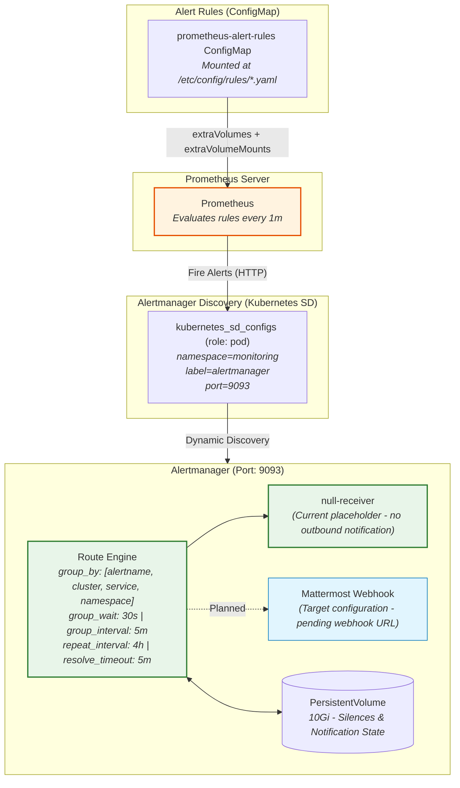

# ADR: Alertmanager Dispatch, Grouping & Notification

## Status
Accepted

## Context
Alertmanager is the centralized notification dispatcher for the production cluster, handling all alerts fired by Prometheus. It must perform intelligent deduplication, grouping, and silencing to prevent notification fatigue during cascading failures, and route resolved alerts for clear incident closure visibility.

---

## Architecture & Alert Flow

### 1. Alert Pipeline Diagram


---

## Decision

1. **Deployment:** Alertmanager is deployed as part of the **`prometheus-community/prometheus`** Helm chart (`alertmanager.enabled: true`) rather than as a standalone component, co-located with the Prometheus server in the `monitoring` namespace.

2. **Alertmanager Discovery (Kubernetes SD):**
   Prometheus uses **Kubernetes pod service discovery** to dynamically locate the Alertmanager endpoint without hardcoding pod IPs:
   ```yaml
   kubernetes_sd_configs:
     - role: pod
   relabel_configs:
     - source_labels: [__meta_kubernetes_namespace]
       regex: monitoring
     - source_labels: [__meta_kubernetes_pod_label_app_kubernetes_io_name]
       regex: alertmanager
     - source_labels: [__meta_kubernetes_pod_container_port_number]
       regex: "9093"
   ```

3. **Alert Rules Delivery (ConfigMap Mount):**
   Alerting rule files are stored in a shared Kubernetes ConfigMap (`prometheus-alert-rules`) and mounted into the Prometheus pod at `/etc/config/rules/*.yaml` via `extraVolumes` and `extraVolumeMounts`. This enables GitOps-style rule management without Prometheus server restarts.

4. **Grouping & Deduplication:**
   - **Group by:** `['alertname', 'cluster', 'service', 'namespace']` — ensures related alerts in the same scope are batched into a single notification.
   - **`group_wait: 30s`** — buffer time to collect all alert instances before sending the first notification.
   - **`group_interval: 5m`** — minimum time between follow-up notifications for the same group.
   - **`repeat_interval: 4h`** — suppression window for repeated notifications of the same ongoing alert.
   - **`resolve_timeout: 5m`** — time before an alert transitions to resolved if no longer firing.

5. **Notification Receiver:**
   - **Current:** Default receiver is `null-receiver` (no outbound notifications) — this is the **sandbox baseline** while the Mattermost webhook URL is pending configuration.
   - **Target:** Route critical alerts to a Mattermost channel via an incoming webhook (`send_resolved: true` to surface resolution events).

6. **State Persistence:**
   - Production Alertmanager uses a **10Gi PersistentVolume** (`alertmanager.persistentVolume.enabled: true, size: 10Gi`) to durably store silence definitions and notification state across pod restarts.
   - Dev uses no persistent volume (ephemeral state acceptable in the sandbox).

---

## Implemented Alert Rules (`deployment/common/alerts/prometheus-alerting-rules.yaml`)

| Alert Name | Expression | For | Severity | Purpose |
| :--- | :--- | :--- | :--- | :--- |
| `InstanceAbsent` | `absent(up{service_name="spring-boot-app"})` | 1m | critical | Dead-man switch: fires when Prometheus receives no metrics at all (pod scaled to 0 or Alloy cannot reach it). |
| `InstanceDown` | `up{service_name="spring-boot-app"} == 0` | 1m | critical | Fires when the pod is running but the metrics scrape endpoint returns an error. |
| `HighCpuUsage` | `rate(container_cpu_usage_seconds_total[5m]) > 0.8` | 2m | warning | Detects pods consuming more than 80% of their allocated CPU. |
| `PokemonApiHighErrorRate` | `rate(pokemon_controller_seconds_count{outcome="SERVER_ERROR"}[5m]) / total * 100 > 5` | 5m | critical | Business SLA: fires when server error rate on the Pokemon API exceeds 5%. |
| `PokemonApiHighLatency` | `histogram_quantile(0.99, rate(pokemon_controller_seconds_bucket[5m])) * 1000 > 2000` | 5m | warning | Business SLA: fires when P99 latency of the Pokemon API exceeds 2000ms. |

---

## Technical Specification & Implementation Mapping

| Key / Config Path | Value / Setting | Purpose | Environment |
| :--- | :--- | :--- | :--- |
| `alertmanager.enabled` | `true` | Deploy Alertmanager alongside Prometheus. | dev, prod |
| `alertmanager.persistentVolume` | `enabled: true, size: 10Gi` | Persist silence rules and notification state. | prod only |
| `config.alerting.alertmanagers` | Kubernetes SD (namespace=monitoring, port=9093) | Dynamic Alertmanager pod discovery. | dev, prod |
| `server.config.rule_files` | `/etc/config/rules/*.yaml` | Loads alert rules from mounted ConfigMap. | dev, prod |
| `extraVolumes / extraVolumeMounts` | ConfigMap: `prometheus-alert-rules` | GitOps-managed alert rule delivery. | dev, prod |
| `route.group_by` | `['alertname', 'cluster', 'service', 'namespace']` | Deduplication and notification consolidation. | dev, prod |
| `route.group_wait` | `30s` | Buffer time before initial notification. | dev, prod |
| `route.group_interval` | `5m` | Minimum time between follow-up notifications. | dev, prod |
| `route.repeat_interval` | `4h` | Suppression window for ongoing alert re-notification. | dev, prod |
| `route.receiver` | `null-receiver` (current) | Sandbox placeholder; Mattermost is the target. | dev, prod |

---

## Consequences

- **Positive:**
  - Kubernetes SD ensures Alertmanager is always discovered dynamically, surviving pod rescheduling without config changes.
  - GitOps-managed alert rules (ConfigMap) allow rule changes without Prometheus pod restarts.
  - Grouping by `[alertname, cluster, service, namespace]` prevents cascade-flood during infrastructure-wide outages.
- **Negative:**
  - Mattermost webhook is not yet configured — all alerts currently route to `null-receiver` (silent).
- **Risk:**
  - If the ConfigMap `prometheus-alert-rules` is deleted or malformed, Prometheus will load no alerting rules and fire no alerts until corrected.
