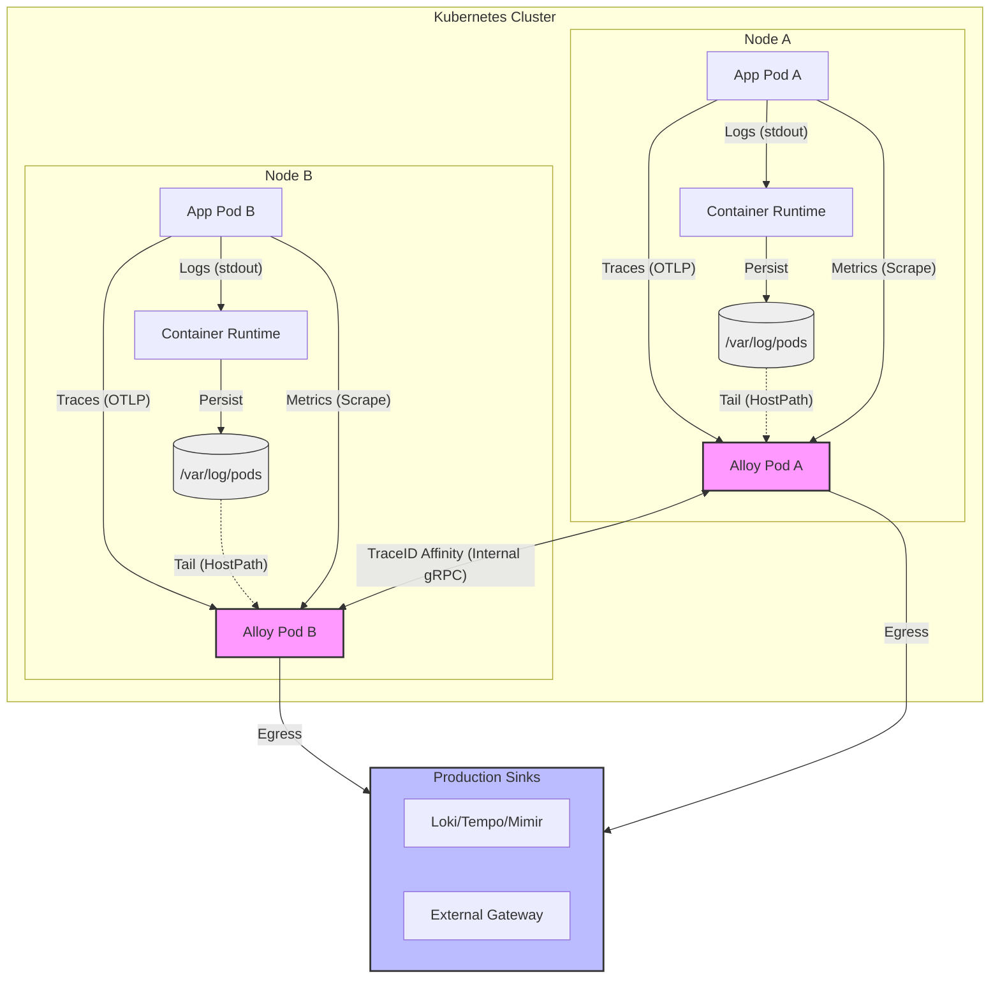

# ADR: Grafana Alloy Collection & Sampling

## Status
Proposed

## Context
The production environment requires a scalable, highly available telemetry collection layer that can enrich data with Kubernetes metadata and manage costs through intelligent sampling of high-volume trace data. The current cluster consists of 6 worker nodes serving approximately 40 application replicas. Additionally, there is a requirement to potentially forward data to an external gateway managed by another team.

## Decision

### Topology & Data Flow Diagram

1.  **Deployment Topology:** Deploy Grafana Alloy as a **DaemonSet** for multi-node production clusters. For HA validation in single-node sandboxes, a **Deployment (2+ replicas)** with internal clustering is used.
2.  **Telemetry Processing Model:**
    *   **Local-Only Path (Logs & Metrics):** Logs are trailed from node-local `/var/log/pods` and **enriched with K8s labels** via the local Kubelet. Metrics are scraped locally. This data is exported directly to egress.
    *   **Clustered Path (Traces):** Ingested from local pods but load-balanced cluster-wide to ensure "TraceID Affinity" before tail-based sampling and export.
3.  **Log Processing Standard:** Use `loki.process` to extract high-cardinality fields (e.g., `trace_id`, `span_id`, `user_id`) and **promote them to Structured Metadata** rather than indexed labels.
4.  **Metrics Processing Standard:** All metrics must be exported via the **Prometheus Remote Write** protocol, ensuring **Exemplars** are preserved for Metric-to-Trace navigation.
5.  **Connection Method:** 
    *   Applications will NOT use the central `alloy.monitoring.svc` ClusterIP for OTLP traffic to avoid gRPC load balancing "stickiness" issues.
    *   Applications will use the **Kubernetes Downward API** to target their local node: `OTEL_EXPORTER_OTLP_ENDPOINT=http://$(NODE_IP):4317`.
6.  **Tail-Based Sampling:** Enable **Clustered Tail-Based Sampling** for traces to manage storage costs while preserving 100% of error traces.
7.  **External Forwarding:** Configure Alloy as a **Multi-Exporter Gateway** to support selective mirroring of telemetry to external central gateways.
8.  **Local SSD Persistence:** Provision a **10Gi - 20Gi local SSD PVC** for each Alloy pod for the Write-Ahead Log (WAL), ensuring data durability during backend outages.
9.  **Infrastructure Prerequisite (RBAC):** The Alloy ServiceAccount must be bound to a **ClusterRole** with `get`, `watch`, and `list` permissions for `pods`, `namespaces`, and `nodes` to enable metadata enrichment.

## Rationale
- **Structured Metadata Efficiency:** Promoting fields like `trace_id` allows for seamless correlation in Grafana without the memory-intensive cost of indexing high-cardinality labels in Loki.
- **Exemplar Preservation:** Standardizing on Remote Write with Exemplar support ensures that spikes in metrics can be instantly correlated to specific traces.
- **Elimination of gRPC LB Issues:** By forcing 1-to-1 local communication (App -> Local Alloy), we bypass the limitations of Layer 4 (TCP) load balancers which cannot properly distribute long-lived gRPC streams.
- **DaemonSet Performance:** Provides direct file access for log collection, reducing Control Plane pressure and network hops.
- **Node-Level Enrichment:** Running on every node enables the `k8sattributes` processor to perform low-latency metadata lookups via the local Kubelet.
- **Unified Egress:** Acting as a gateway for external teams ensures a single point of control for security auditing, PII masking, and data routing without requiring changes to application code.
- **Resilience via WAL:** Persistent local storage allows Alloy to buffer data for up to 1 hour if the backend is unreachable, preventing data loss during network partitions.

## Scaling & Topology Breakpoints
This architecture should be re-evaluated if the following thresholds are reached:
- **The Memory Wall:** If Tail-Sampling requirements (`decision_wait`) cause Alloy's memory usage to exceed **1Gi per node**, consider a hybrid model (DaemonSet for logs, centralized Deployment for traces).
- **Connection Churn:** If the cluster-wide count of concurrent gRPC streams exceeds **5,000**, investigate L7 load balancing (e.g., Istio/Linkerd) or further distribution.
- **Ingestion Lag:** If "p99 Ingestion Lag" exceeds **200ms**, it indicates node-level resource starvation.

## Implementation Source of Truth
- **Helm Value:** `controller.type: daemonset`
- **Application Config:** Use Downward API `status.hostIP` for the OTLP endpoint.
- **Alloy Config:** `otelcol.processor.tail_sampling`, `otelcol.exporter.loadbalancing`, and `loki.process`.
- **Permissions:** ClusterRole with read access to pods/nodes/namespaces.
- **Termination:** `terminationGracePeriodSeconds: 60`.

## Technical Specification & Mapping
This table maps the production implementation in `deployment/prod/values-alloy.yaml` to the architectural decisions and requirements.

| YAML Path / Component | Logic / Value | Functional Purpose | Requirement / ADR Link |
| :--- | :--- | :--- | :--- |
| `controller.type` | `deployment` | HA validation (2 replicas) for local sandboxes. | `ADR` Sec 1 / `req` Sec 2 |
| `alloy.clustering.enabled` | `true` | Enables Gossip (7946) for trace affinity. | `ADR` Sec 4 / `REQUIREMENTS` Sec 1.2 |
| `service.clusterIP` | `None` | Headless service for pod discovery by loadbalancer. | `ADR` Sec 3.0 |
| `discovery.relabel` | `${HOSTNAME}` | **Critical:** Filters scraping to only local node pods. | `req/alloy.md` Sec 5.0 |
| `otelcol.receiver.otlp` | port `4317` | Standard OTLP/gRPC ingestion from applications. | `req/alloy.md` Sec 2.0 |
| `otelcol.exporter.loadbalancing` | port `4318` | Distributes spans across cluster for sampling affinity. | `ADR` Sec 4 / `req` Sec 4 |
| `otelcol.processor.tail_sampling` | `decision_wait: 10s` | authoritative decision point for trace storage cost. | `ADR` Sec 4 / `req` Sec 4 |
| `loki.process` | `structured_metadata` | Promotes `trace_id` for efficient correlation. | `ADR` Sec 3 / `req` Sec 3 |
| `prometheus.remote_write` | `send_exemplars: true` | Enables Metric-to-Trace navigation in Grafana. | `ADR` Sec 4 / `req` Sec 5 |
| `persistence.size` | `20Gi SSD` | Survive 1hr backend outage via local WAL. | `ADR` Sec 8 / `req` Sec 5 |
| `terminationGracePeriod` | `60s` | Completes sampling decisions during pod restart. | `ADR` Sec 11 / `req` Sec 6 |

## Consequences
- **Positive:** Robust internal networking, automated horizontal scaling, and future-proofed for cross-team data sharing.
- **Negative:** Higher aggregate resource footprint (6 pods vs. 2-3).
- **Risk:** Trace data currently in memory for the `decision_wait` window is lost if a pod is terminated.
