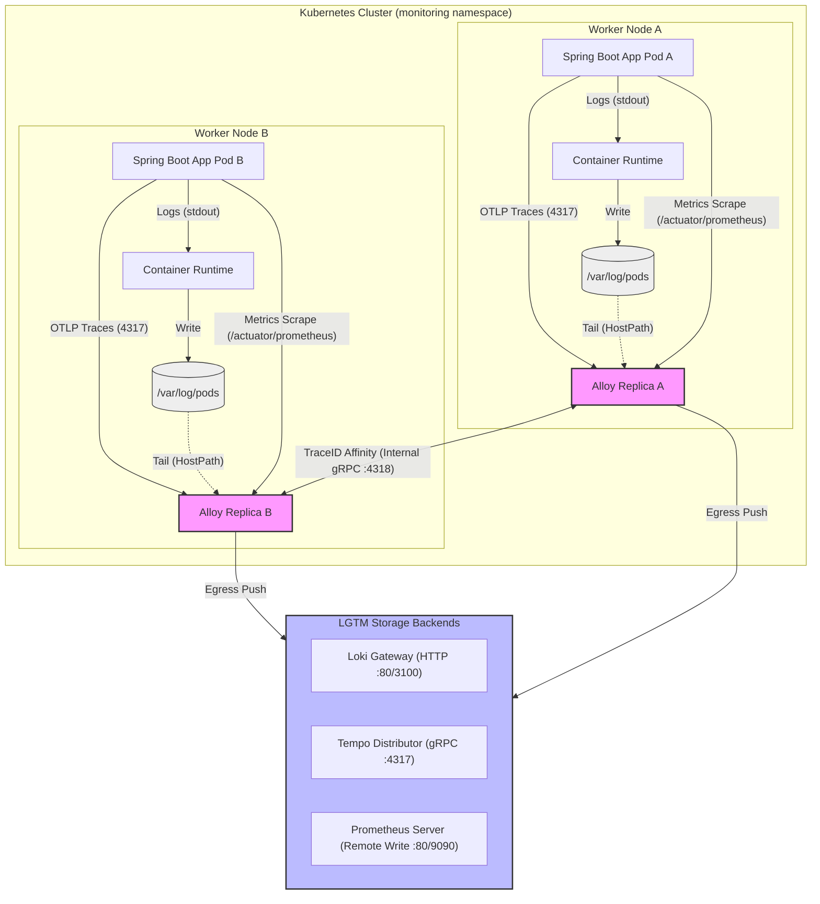
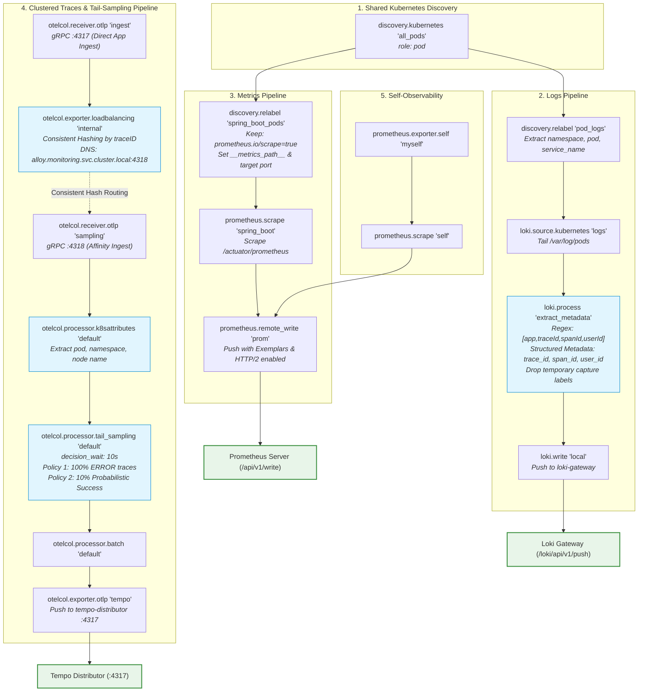

# ADR: Grafana Alloy Collection & Sampling

## Status
Accepted

## Context
The production environment requires a scalable, highly available telemetry collection layer that can enrich data with Kubernetes metadata and manage costs through intelligent sampling of high-volume trace data. The current cluster consists of 6 worker nodes serving approximately 40 application replicas. Additionally, there is a requirement to potentially forward data to an external gateway managed by another team.

---

## Architecture & Internal Pipeline Configuration

### 1. High-Level Cluster Topology & Data Flow

```mermaid
flowchart TD
    subgraph Cluster ["Kubernetes Cluster (monitoring namespace)"]
        subgraph Node_A ["Worker Node A"]
            AppA["Spring Boot App Pod A"] -- "OTLP Traces (4317)" --> AlloyA["Alloy Replica A"]
            AppA -- "Logs (stdout)" --> RuntimeA["Container Runtime"]
            RuntimeA -- "Write" --> DiskA[("/var/log/pods")]
            DiskA -. "Tail (HostPath)" .-> AlloyA
            AppA -- "Metrics Scrape (/actuator/prometheus)" --> AlloyA
        end

        subgraph Node_B ["Worker Node B"]
            AppB["Spring Boot App Pod B"] -- "OTLP Traces (4317)" --> AlloyB["Alloy Replica B"]
            AppB -- "Logs (stdout)" --> RuntimeB["Container Runtime"]
            RuntimeB -- "Write" --> DiskB[("/var/log/pods")]
            DiskB -. "Tail (HostPath)" .-> AlloyB
            AppB -- "Metrics Scrape (/actuator/prometheus)" --> AlloyB
        end

        %% Inter-pod trace affinity load-balancing
        AlloyA <--> |"TraceID Affinity (Internal gRPC :4318)"| AlloyB
    end

    AlloyA -- "Egress Push" --> Sinks
    AlloyB -- "Egress Push" --> Sinks

    subgraph Sinks ["LGTM Storage Backends"]
        LOKI["Loki Gateway (HTTP :80/3100)"]
        TEMPO["Tempo Distributor (gRPC :4317)"]
        PROM["Prometheus Server (Remote Write :80/9090)"]
    end

    style AlloyA fill:#f9f,stroke:#333,stroke-width:2px
    style AlloyB fill:#f9f,stroke:#333,stroke-width:2px
    style Sinks fill:#bbf,stroke:#333,stroke-width:2px
    style DiskA fill:#eee,stroke:#333
    style DiskB fill:#eee,stroke:#333
```

---

### 2. Detailed Alloy River Internal Component Pipeline
The diagram below illustrates the exact component flow defined in `configMap.content` (`config.alloy`):

```mermaid
flowchart TD
    %% SHARED DISCOVERY
    subgraph Discovery ["1. Shared Kubernetes Discovery"]
        RADAR["discovery.kubernetes 'all_pods'<br/><i>role: pod</i>"]
    end

    %% LOGS PIPELINE
    subgraph LogsPipeline ["2. Logs Pipeline"]
        RELABEL_LOGS["discovery.relabel 'pod_logs'<br/><i>Extract namespace, pod, service_name</i>"]
        SOURCE_LOGS["loki.source.kubernetes 'logs'<br/><i>Tail /var/log/pods</i>"]
        PROCESS_LOGS["loki.process 'extract_metadata'<br/><i>Regex: [app,traceId,spanId,userId]<br/>Structured Metadata: trace_id, span_id, user_id<br/>Drop temporary capture labels</i>"]
        WRITE_LOKI["loki.write 'local'<br/><i>Push to loki-gateway</i>"]

        RADAR --> RELABEL_LOGS --> SOURCE_LOGS --> PROCESS_LOGS --> WRITE_LOKI
    end

    %% METRICS PIPELINE
    subgraph MetricsPipeline ["3. Metrics Pipeline"]
        RELABEL_METRICS["discovery.relabel 'spring_boot_pods'<br/><i>Keep: prometheus.io/scrape=true<br/>Set __metrics_path__ & target port</i>"]
        SCRAPE_METRICS["prometheus.scrape 'spring_boot'<br/><i>Scrape /actuator/prometheus</i>"]
        WRITE_PROM["prometheus.remote_write 'prom'<br/><i>Push with Exemplars & HTTP/2 enabled</i>"]

        RADAR --> RELABEL_METRICS --> SCRAPE_METRICS --> WRITE_PROM
    end

    %% TRACES PIPELINE
    subgraph TracesPipeline ["4. Clustered Traces & Tail-Sampling Pipeline"]
        RECV_INGEST["otelcol.receiver.otlp 'ingest'<br/><i>gRPC :4317 (Direct App Ingest)</i>"]
        LB_EXPORT["otelcol.exporter.loadbalancing 'internal'<br/><i>Consistent Hashing by traceID<br/>DNS: alloy.monitoring.svc.cluster.local:4318</i>"]
        RECV_SAMPLING["otelcol.receiver.otlp 'sampling'<br/><i>gRPC :4318 (Affinity Ingest)</i>"]
        K8S_ATTRS["otelcol.processor.k8sattributes 'default'<br/><i>Extract pod, namespace, node name</i>"]
        TAIL_SAMPLE["otelcol.processor.tail_sampling 'default'<br/><i>decision_wait: 10s<br/>Policy 1: 100% ERROR traces<br/>Policy 2: 10% Probabilistic Success</i>"]
        BATCH["otelcol.processor.batch 'default'"]
        EXPORT_TEMPO["otelcol.exporter.otlp 'tempo'<br/><i>Push to tempo-distributor :4317</i>"]

        RECV_INGEST --> LB_EXPORT
        LB_EXPORT -.->|"Consistent Hash Routing"| RECV_SAMPLING
        RECV_SAMPLING --> K8S_ATTRS --> TAIL_SAMPLE --> BATCH --> EXPORT_TEMPO
    end

    %% SELF-OBSERVABILITY
    subgraph SelfObservability ["5. Self-Observability"]
        SELF_EXP["prometheus.exporter.self 'myself'"]
        SELF_SCRAPE["prometheus.scrape 'self'"]

        SELF_EXP --> SELF_SCRAPE --> WRITE_PROM
    end

    %% Sinks
    WRITE_LOKI --> SINK_LOKI["Loki Gateway (/loki/api/v1/push)"]
    WRITE_PROM --> SINK_PROM["Prometheus Server (/api/v1/write)"]
    EXPORT_TEMPO --> SINK_TEMPO["Tempo Distributor (:4317)"]

    classDef proc fill:#e1f5fe,stroke:#0288d1,stroke-width:1px;
    classDef sink fill:#e8f5e9,stroke:#388e3c,stroke-width:2px;
    class SINK_LOKI,SINK_PROM,SINK_TEMPO sink;
    class PROCESS_LOGS,TAIL_SAMPLE,K8S_ATTRS,LB_EXPORT proc;
```

---

## Decision

1. **Deployment Topology:** Deploy Grafana Alloy as a **Deployment (2+ replicas)** with gossip clustering enabled (`alloy.clustering.enabled: true`) for HA validation in single-node and multi-node sandboxes. For pure multi-node clusters, DaemonSet can be selected via `controller.type: daemonset`.
2. **Telemetry Processing Model:**
   * **Logs:** Discovered dynamically via `discovery.kubernetes "all_pods"` and tailed from `/var/log/pods`. High-cardinality correlation fields (`trace_id`, `span_id`, `user_id`) are extracted from log formatting and promoted to **Structured Metadata** rather than indexed labels via `loki.process`.
   * **Metrics:** Scraped via annotation filtering (`prometheus.io/scrape: "true"`) from Spring Boot Actuator endpoints. Pushed via **Prometheus Remote Write** with **Exemplars** and HTTP/2 enabled.
   * **Traces:** Ingested on port `4317`, load-balanced across the cluster via consistent hashing on `traceID` to port `4318` (`otelcol.exporter.loadbalancing`), enriched with Kubernetes attributes, evaluated via **tail-based sampling** (`decision_wait: 10s`, keeping 100% of errors and 10% of successful spans), batched, and exported to Tempo.
   * **Self-Observability:** Alloy scrapes its own internal collector performance metrics via `prometheus.exporter.self "myself"` and pushes them to Prometheus.
3. **Connection Method:**
   * In local sandboxes and HA deployments, applications target Alloy via OTLP gRPC (`alloy.monitoring.svc.cluster.local:4317`).
   * When deployed as a DaemonSet, applications use the **Kubernetes Downward API** (`status.hostIP:4317`) to avoid long-lived gRPC stickiness on L4 balancers.
4. **Resilience & Graceful Termination:**
   * Provision a **5Gi - 20Gi local SSD PVC** for Alloy's Write-Ahead Log (`storagePath: /var/lib/alloy/data`) to survive backend outages.
   * Set `terminationGracePeriodSeconds: 60` to ensure buffered spans complete their `10s` decision wait before pod shutdown.
   * Configure `podDisruptionBudget` with `maxUnavailable: 1` to prevent split-brain during rolling upgrades.

---

## Technical Specification & Implementation Mapping

This table maps the production implementation in `deployment/prod/values-alloy.yaml` and `deployment/prod-local/values-alloy.yaml` to the architectural decisions:

| River Component / Helm Key | Value / Logic | Purpose | Architecture Role |
| :--- | :--- | :--- | :--- |
| `controller.type` | `deployment` (`replicas: 2`) | HA clustered deployment for local sandboxes & cloud environments. | Core Topology |
| `alloy.clustering.enabled` | `true` | Enables Gossip protocol (port 7946) across Alloy replicas. | Clustering |
| `alloy.extraPorts` | `4317` (otlp-grpc), `4318` (otlp-sampling) | Ingestion entrypoint & internal trace affinity receiving port. | Networking |
| `alloy.service.clusterIP` | `None` | Headless service for direct pod-to-pod DNS resolution in load balancing exporter. | Discovery |
| `discovery.kubernetes "all_pods"` | `role = "pod"` | Central pod discovery for log tailing and Prometheus scraping. | Discovery |
| `discovery.relabel "pod_logs"` | Extracts `namespace`, `pod`, `service_name` | Canonical log stream labelling. | Logs |
| `loki.process "extract_metadata"` | Regex extraction & `stage.structured_metadata` | Promotes `trace_id`, `span_id`, and `user_id` without index bloat. | Logs / Correlation |
| `discovery.relabel "spring_boot_pods"` | Checks `prometheus.io/scrape: "true"` | Annotation-driven scraping of Spring Boot Actuator pods. | Metrics |
| `prometheus.remote_write "prom"` | `send_exemplars: true`, `enable_http2: true` | Pushes scraped metrics with Exemplars for Trace-to-Metric navigation. | Metrics |
| `otelcol.receiver.otlp "ingest"` | Port `4317` | Direct OTLP/gRPC ingestion from applications. | Traces |
| `otelcol.exporter.loadbalancing "internal"` | Hashing on `traceID`, targets port `4318` | Enforces TraceID affinity so all spans of a trace arrive at the same replica. | Traces / Sampling |
| `otelcol.processor.k8sattributes "default"` | Extracts `k8s.pod.name`, `k8s.namespace.name`, `k8s.node.name` | Enriches traces with infrastructure context based on client IP. | Enrichment |
| `otelcol.processor.tail_sampling "default"` | `decision_wait: 10s` Errors: 100% Success: 10% | Intelligent cost reduction while guaranteeing retention of faulty traces. | Sampling |
| `otelcol.processor.batch "default"` | Batches after sampling | Efficient network transport to Tempo distributor. | Optimization |
| `prometheus.exporter.self "myself"` | Internal scrape | Self-monitoring of Alloy pipeline health, memory, and queue lengths. | Self-Monitoring |
| `terminationGracePeriodSeconds` | `60` | Allows 10s decision wait window to drain cleanly during restarts. | Resilience |
| `persistence.enabled` | `true` (`size: 5Gi - 20Gi`) | Write-Ahead Log (WAL) persistence against upstream outages. | Durability |

---

## Consequences

- **Positive:**
  - Guaranteed 100% retention of error traces while slashing routine trace storage volume by 90%.
  - Zero log label cardinality explosion by using Loki Structured Metadata for `trace_id` and `user_id`.
  - Seamless Metric-to-Trace and Trace-to-Log bidirectional navigation in Grafana.
  - Fully resilient to node churn and rolling upgrades with WAL and graceful drain periods.
  - Native DAG fan-out support: capable of dual-shipping signals to secondary sinks (e.g., Redpanda/Kafka) with built-in bridges (`otelcol.receiver.loki`, `otelcol.receiver.prometheus`) and zero external drivers (see [notes/ALLOY_SECONDARY_KAFKA_EXPORT.md](../notes/ALLOY_SECONDARY_KAFKA_EXPORT.md)).
- **Negative:**
  - Trace buffering introduces a 10-second latency before traces appear in Tempo.
  - Higher memory usage per replica due to trace buffering and gossip communication.
