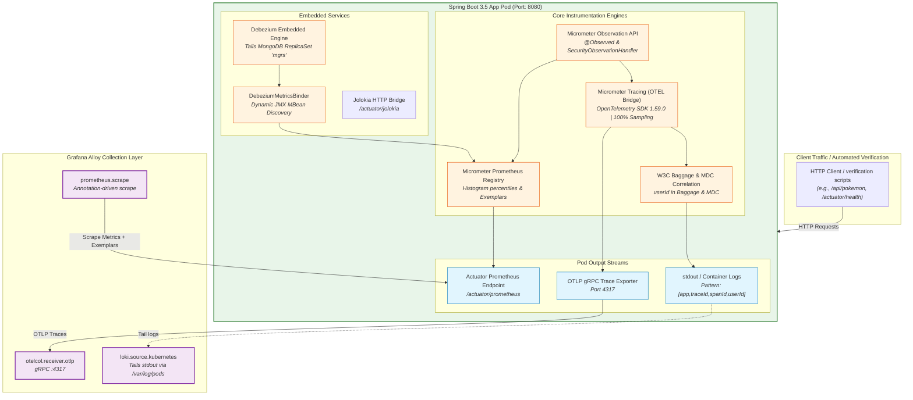

# ADR: Spring Boot Application Instrumentation & Telemetry Pipeline

## Status
Accepted

## Context
The Spring Boot 3.5 (Java 25) application is the primary telemetry and business workload generator in the sandbox. It must provide rich, correlated observability signals (Traces, Metrics, Logs) that traverse Grafana Alloy into Loki, Tempo, and Prometheus/Mimir without manual correlation glue code. Key requirements include:
- **Zero-Drop Tracing at Source:** 100% trace sampling at application level (delegating tail-sampling reduction to Grafana Alloy).
- **Context & Baggage Propagation:** End-to-end W3C Trace Context and Baggage propagation across service boundaries, synchronized to both MDC (for logs) and span attributes (for traces).
- **Unified Log Correlation:** Structured logging format emitting `[app,traceId,spanId,userId]` enabling Alloy to promote `trace_id`, `span_id`, and `user_id` to Loki Structured Metadata.
- **Exemplars & Percentile Distributions:** Direct navigation from latency metric percentiles to Tempo traces.
- **Resilient Connectivity:** Standardized OTLP gRPC endpoint targeting and annotation-driven metric scraping.

---

## Architecture & Telemetry Data Flow

### 1. Application Telemetry Generation & Export Pipeline


---

## Decision

1. **OTLP Tracing Architecture:**
   - **Framework:** Micrometer Tracing with OpenTelemetry SDK Bridge (`micrometer-tracing-bridge-otel`).
   - **Sampling Rate:** Configured to **`1.0` (100% head-sampling)** at the application level (`management.tracing.sampling.probability: 1.0`). Traces are forwarded without loss to Grafana Alloy, where intelligent tail-based sampling (keeping 100% errors and 10% success) is centrally enforced.
   - **Transport & Target:** Export traces via **OTLP gRPC** on port `4317` (`MANAGEMENT_OTLP_TRACING_TRANSPORT=grpc`).
   - **Service Endpoint Target:** In the sandbox and production manifests, applications target `http://alloy.monitoring.svc.cluster.local:4317`. When running in multi-node DaemonSet environments, applications can utilize the **Kubernetes Downward API** (`status.hostIP:4317`) to eliminate cross-node network hops and long-lived gRPC stickiness on L4 load balancers.

2. **Context Propagation & Baggage:**
   - **Standards:** Enforce **W3C Trace Context** (`traceparent`, `tracestate`) and **W3C Baggage** headers across all incoming and outgoing HTTP/messaging boundaries (`management.tracing.propagation.produce: [w3c]`, `consume: [w3c]`).
   - **Remote Baggage Fields:** Custom context attributes (specifically `userId`) travel in W3C Baggage (`management.tracing.baggage.remote-fields: [userId]`).
   - **MDC Correlation:** Synchronize baggage fields to the SLF4J Mapped Diagnostic Context (MDC) automatically (`management.tracing.baggage.correlation.fields: [userId]`).

3. **Structured Log Correlation Standard:**
   - Enforce standardized log prefix correlation:
     ```yaml
     logging.pattern.correlation: "[${spring.application.name:},%X{traceId:-},%X{spanId:-},%X{userId:-}]"
     ```
   - Application logs output camelCase (`traceId`, `spanId`, `userId`). Grafana Alloy uses `loki.process` stage regex to extract these capture groups and promotes them to snake_case (`trace_id`, `span_id`, `user_id`) in **Loki Structured Metadata**.

4. **Metrics, Histograms & Exemplars:**
   - **Actuator Scrape Path:** Exposed at `/actuator/prometheus` and enabled via Pod annotations:
     ```yaml
     prometheus.io/scrape: "true"
     prometheus.io/path: "/actuator/prometheus"
     prometheus.io/port: "8080"
     ```
   - **Exemplars:** Enabled at the application Prometheus registry (`management.prometheus.metrics.export.exemplars.enabled: true`). When trace context is active, metric observations automatically record the active `traceId` as an exemplar.
   - **Percentile Distributions:** Enable native latency percentiles and histogram buckets for HTTP server requests, HTTP client calls, and MongoDB commands (`management.metrics.distribution.percentiles-histogram.*: true`).

5. **Resource Context & Environment Segmentation:**
   - Application deployments must declare standard OpenTelemetry resource attributes via `OTEL_RESOURCE_ATTRIBUTES`:
     ```yaml
     - name: OTEL_RESOURCE_ATTRIBUTES
       value: "deployment.environment=production,service.version=1.0.0"
     ```
   - Enables multi-tenancy and environment separation in Loki, Tempo, and Prometheus without requiring separate cluster deployments.

6. **Embedded Debezium CDC Pipeline:**
   - Runs in-process inside the Spring Boot container, capturing changes from the MongoDB ReplicaSet (`mgrs`).
   - JMX MBeans are dynamically surfaced to Micrometer via `DebeziumMetricsBinder`, making CDC lag and snapshot metrics available on `/actuator/prometheus`.
   - Raw JMX endpoint accessible via `/actuator/jolokia`.

---

## Technical Specification & Implementation Mapping

This table maps the application properties and Kubernetes manifests to architectural decisions:

| Key / Property | Location | Configured Value | Architectural Role |
| :--- | :--- | :--- | :--- |
| `management.tracing.sampling.probability` | `application.yaml` | `1.0` (100%) | Full trace capture at source; tail-sampling in Alloy. |
| `management.tracing.propagation` | `application.yaml` | `[w3c]` | Inter-service W3C TraceContext & Baggage standard. |
| `management.tracing.baggage.remote-fields`| `application.yaml` | `[userId]` | Cross-service user attribute propagation. |
| `management.tracing.baggage.correlation.fields`| `application.yaml` | `[userId]` | Automatic baggage injection into SLF4J MDC. |
| `logging.pattern.correlation` | `application.yaml` | `[${spring.application.name:},%X{traceId:-},%X{spanId:-},%X{userId:-}]` | Log-to-Trace and Log-to-User correlation standard. |
| `management.prometheus.metrics.export.exemplars.enabled` | `application.yaml` | `true` | Links Prometheus metric spikes to Tempo traces. |
| `management.metrics.distribution.percentiles-histogram.*`| `application.yaml` | `true` | P95/P99 latency calculations for HTTP & MongoDB. |
| `MANAGEMENT_OTLP_TRACING_ENDPOINT` | `app.yaml` | `http://alloy.monitoring.svc.cluster.local:4317` | OTLP gRPC trace ingestion destination. |
| `MANAGEMENT_OTLP_TRACING_TRANSPORT` | `app.yaml` | `grpc` | High-efficiency gRPC protocol for traces. |
| `OTEL_RESOURCE_ATTRIBUTES` | `app.yaml` | `deployment.environment=production,service.version=1.0.0` | Global service segmentation tags. |
| `prometheus.io/scrape` annotations | `app.yaml` | `scrape: true, path: /actuator/prometheus, port: 8080` | Annotation-driven discovery by Grafana Alloy. |
| `DEBEZIUM_MONGODB_CONNECTION_STRING` | `app.yaml` | Multi-node replica set connection string | Change Data Capture ingestion from MongoDB. |
| `livenessProbe` / `readinessProbe` | `app.yaml` | `/actuator/health/liveness` & `/readiness` | Kubernetes pod lifecycle and zero-downtime rollouts. |

---

## Consequences

- **Positive:**
  - Complete 360-degree observability from a single JVM process (Metrics with Exemplars, Traces with Baggage, Logs with Structured Metadata).
  - No sampling bias at the application layer; Alloy makes holistic tail-sampling decisions across distributed traces.
  - Zero-effort correlation between user transactions and database CDC events.
- **Negative:**
  - 100% head-sampling increases memory and serialization CPU load in high-throughput applications compared to 1% head-sampling.
  - In-process Debezium engine shares heap space with application workloads (addressed with 1Gi–2Gi memory requests/limits).
- **Risk:**
  - If Grafana Alloy becomes unreachable, the OTLP trace exporter buffer may fill; connection timeouts must be bounded to avoid blocking application threads.
