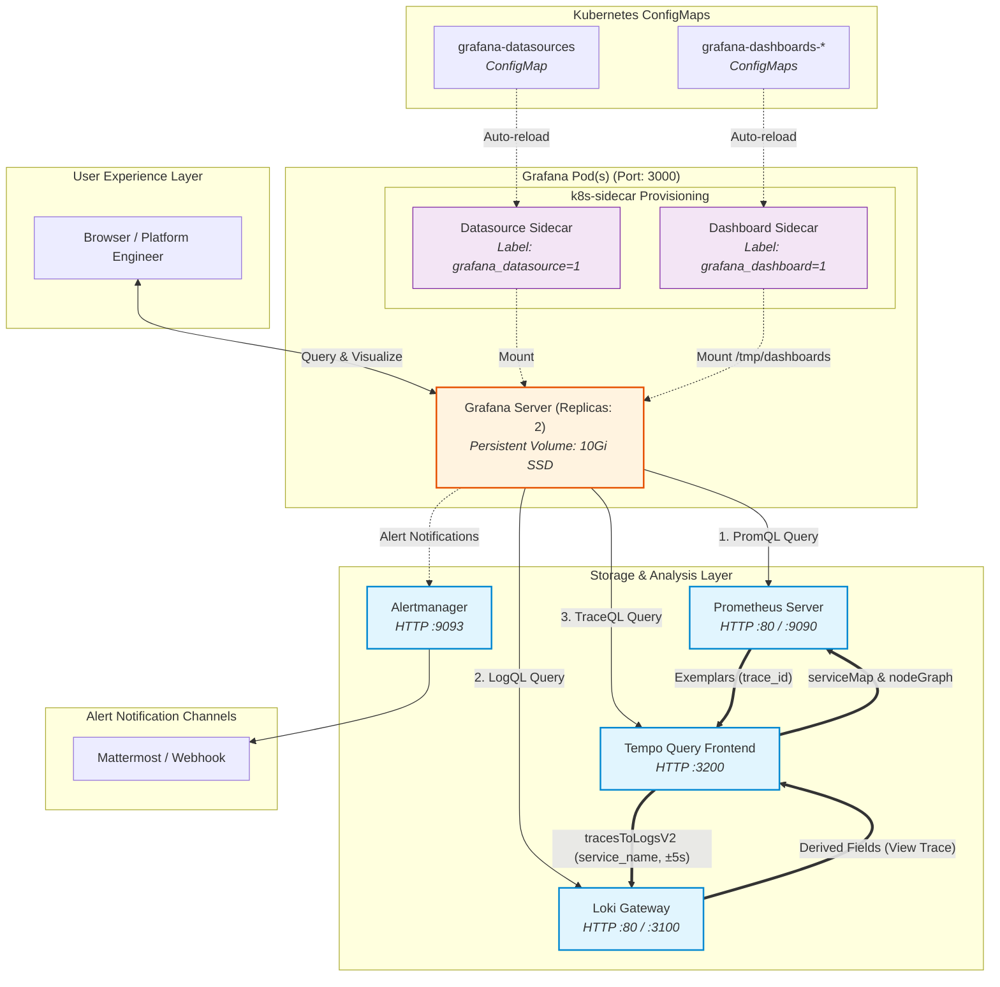

# ADR: Grafana Visualization, Correlation & Alerting

## Status
Accepted

## Context
Grafana serves as the central observability and visualization control plane for the LGTM stack. It must provide high-availability visualization, seamless cross-telemetry navigation (Metric ➔ Trace ➔ Log), and reliable alerting while ensuring dashboard and datasource definitions are version-controlled, GitOps-compatible, and resistant to pod-level volatility.

---

## Architecture & Data Flow

### 1. Unified Observability & Correlation Diagram
The following diagram illustrates how Grafana connects to the LGTM backends and orchestrates bidirectional correlation across Prometheus, Loki, and Tempo:

---

## Decision

1. **Deployment Topology & Scaling:**
   - Deploy Grafana with **`replicas: 2`** in production for high availability and zero-downtime rolling restarts.
   - Secure admin credentials using Kubernetes Secret `grafana-admin-credentials` via `admin.existingSecret: grafana-admin-credentials`.
   - Disable anonymous telemetry reporting and automated update checks (`reporting_enabled: false`, `check_for_updates: false`).

2. **GitOps & Declarative Provisioning (Sidecar Pattern):**
   - **Dashboards as Code:** Use `sidecar.dashboards.enabled: true` targeting ConfigMaps labelled with `grafana_dashboard: "1"`. Folder hierarchy is maintained automatically using folder annotation `grafana_folder: "Loki"` (or "General", "Debezium", etc.).
   - **Datasources as Code:** Use `sidecar.datasources.enabled: true` targeting ConfigMaps labelled with `grafana_datasource: "1"`.

3. **Bidirectional Cross-Telemetry Correlation:**
   All datasources are provisioned with standardized linkage to allow frictionless drill-down across signals:
   - **Metrics ➔ Traces (Exemplars):** Prometheus datasource is configured with `exemplarTraceIdDestinations` targeting `tempo` using `trace_id`. Clicking a latency spike exemplar opens the exact trace in Tempo.
   - **Logs ➔ Traces (Derived Fields):** Loki datasource includes regex derived fields matching `traceId` / `trace_id` (32-character hex) with a clickable `View Trace` deep-link to Tempo.
   - **Traces ➔ Logs (`tracesToLogsV2`):** Tempo datasource links back to Loki automatically filtering by `service_name` and bounding time by `spanStartTimeShift: '-5s'` and `spanEndTimeShift: '5s'`.
   - **Traces ➔ Metrics (Service Map):** Tempo connects to Prometheus for Service Graph and Node Graph rendering (`serviceMap` and `nodeGraph: enabled`).

4. **State Persistence:**
   - **Sandbox / Local Production:** State (user preferences, local settings) is persisted via a **10Gi SSD PersistentVolumeClaim** (`persistence.enabled: true`).
   - **Multi-Replica Enterprise:** In scaled enterprise environments with >2 replicas where shared PVC access (RWX) is unavailable, state should be backed by an external managed PostgreSQL database (`grafana.ini [database] type = postgres`).

5. **Alerting & Dispatch:**
   - Centralize all alert dispatching through **Alertmanager** (port `9093`), routing notifications to Mattermost.
   - Alert rules must leverage `absent()` conditions to act as dead-man switches for mission-critical collectors and applications.

---

## Technical Specification & Implementation Mapping

This table maps the production implementation in `deployment/prod/values-grafana.yaml` and `deployment/common/datasources/datasources.yaml` to the architectural decisions:

| Key / Component | Value / Configuration | Purpose | Architectural Role |
| :--- | :--- | :--- | :--- |
| `replicas` | `2` | Redundancy and rolling upgrade availability. | Topology |
| `admin.existingSecret` | `grafana-admin-credentials` | Decouple administrative credentials from Helm values. | Security |
| `persistence.enabled` | `true` (`size: 10Gi`) | Retain user preferences and operational state across restarts. | Durability |
| `resources` | Requests: `100m / 256Mi` Limits: `cpu: 500m / memory: 1Gi` | Guaranteed baseline with headroom for complex dashboard queries. | Resource Management |
| `sidecar.datasources` | `enabled: true` `label: grafana_datasource=1` | Dynamic provisioning of Prometheus, Loki, and Tempo datasources. | GitOps |
| `sidecar.dashboards` | `enabled: true` `label: grafana_dashboard=1` `folderAnnotation: grafana_folder` | Dynamic dashboard import with automated folder classification. | GitOps |
| `datasources.exemplarTraceIdDestinations` | `datasourceUid: tempo`, `name: trace_id` | Prometheus metric spike to Tempo trace jump. | Correlation |
| `datasources.derivedFields` | Regex matching 32-char trace IDs | Loki log line to Tempo trace jump. | Correlation |
| `datasources.tracesToLogsV2` | `filterByTraceID: true`, `tags: [service.name: service_name]` | Tempo span to Loki logs jump. | Correlation |
| `datasources.serviceMap` | `datasourceUid: prometheus`, `nodeGraph.enabled: true` | Topology dependency visualization from trace metrics. | Visualization |

---

## Consequences

- **Positive:**
  - Zero manual dashboard or datasource configuration; fully reproducible via GitOps ConfigMaps.
  - Complete 360-degree telemetry navigation (Metric ↔ Trace ↔ Log).
  - High availability with 2 replicas and zero downtime during node updates.
- **Negative:**
  - ConfigMap size limitations (1MB max per ConfigMap in Kubernetes) require large dashboards to be split into individual ConfigMaps.
- **Risk:**
  - If ConfigMaps contain malformed JSON/YAML, the sidecar will log an error and skip loading that specific dashboard.
