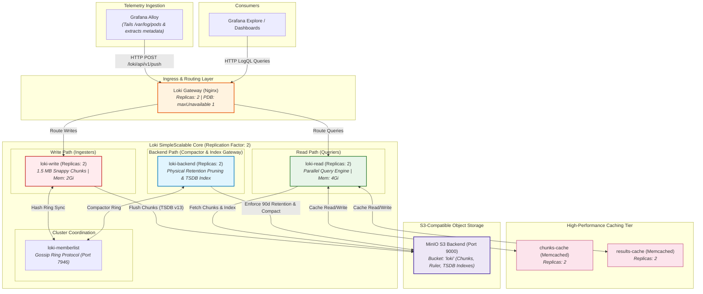

# ADR: Grafana Loki Log Aggregation, Scalability & Durability

## Status
Accepted

## Context
Log telemetry constitutes the highest volume of observability data in the production cluster. The logging infrastructure must be:
- **Horizontally Scalable & Durable:** Capable of surviving pod/node outages without log data loss.
- **Cost-Effective:** Supporting long-term retention (up to 90 days) using S3-compatible object storage.
- **High-Performance:** Providing instant correlation with traces via **Structured Metadata** without exploding label cardinality.
- **Resilient:** Immune to runaway regex queries, large payloads, and split-brain ingestion.

---

## Architecture & Data Flow

### 1. SimpleScalable Mode Topology Diagram
Grafana Loki is deployed in **SimpleScalable mode**, which cleanly decouples the stateful write path from the query-heavy read path and the background maintenance processes:

---

## Decision

1. **Deployment Architecture (SimpleScalable):**
   - Separate Loki into 3 independent target components:
     - **`write` (2 replicas):** Stateful ingesters accepting log streams, buffering chunks in memory, and syncing through the memberlist hash ring.
     - **`read` (2 replicas):** Stateless queriers and query-frontends handling LogQL execution.
     - **`backend` (2 replicas):** Background workers hosting the **Compactor** and **Index Gateway** ring with 15Gi persistence.
   - Front all targets with **`gateway` (2 replicas)** acting as an Nginx reverse proxy.
   - Enforce **PodDisruptionBudgets (`maxUnavailable: 1`)** across all components to ensure zero-downtime rolling upgrades.

2. **Physical Durability & Object Storage:**
   - Use S3-compatible object storage (MinIO in sandbox/prod-local, AWS S3 in cloud) for all log chunks, ruler rules, and TSDB indexes.
   - Set **`commonConfig.replication_factor: 2`** to ensure any single node or pod loss leaves a complete replica in the ring.
   - Inject S3 credentials securely via Kubernetes Secrets (`minio-secret` / `S3_SECRET_KEY`) using `extraEnv` across `write`, `read`, and `backend`.

3. **Retention & Compaction Policy:**
   - **Retention Period:** 90 days (`retention_period: 2160h`) in production (72h in sandbox environments).
   - **Physical Enforcement:** Enable the **Compactor** (`retention_enabled: true`) running every 10 minutes (`compaction_interval: 10m`) with a 2-hour deletion delay to physically erase expired chunks from the S3 bucket.

4. **High-Performance Caching Tier:**
   - Deploy **`chunksCache`** (Memcached, 2 replicas) to prevent redundant chunk retrievals from object storage.
   - Deploy **`resultsCache`** (Memcached, 2 replicas) to instantly serve repeated dashboard queries.

5. **Index Schema & Structured Metadata:**
   - Utilize **`v13 (TSDB)`** schema with 24-hour index buckets.
   - Strictly prohibit indexing high-cardinality values as stream labels. Instead, promote fields like `trace_id`, `span_id`, and `user_id` to **Structured Metadata** at the Alloy collection layer.

6. **Stability & Ingestion Guardrails (`limits_config`):**
   - **Ingestion limits:** Global rate of `10MB/s` with a burst of `20MB/s`; per-stream rate limit of `3MB/s` (`15MB` burst).
   - **Safety constraints:** Maximum line size capped at `256KB`, max label name length `1024`, max label value length `2048`, and `tsdb_max_query_parallelism: 128`.

---

## Technical Specification & Implementation Mapping

This table maps the production implementation in `deployment/prod/values-loki.yaml` and `deployment/prod-local/values-loki.yaml` to the architectural decisions:

| Key / Path | Value / Setting | Purpose | Architectural Role |
| :--- | :--- | :--- | :--- |
| `deploymentMode` | `SimpleScalable` | Decouples write, read, and background maintenance. | Scalability |
| `commonConfig.replication_factor` | `2` | Guarantees quorum and zero data loss on pod failure. | Durability |
| `memberlist.join_members` | `["loki-memberlist"]` | Cluster-wide gossip discovery for Ingester ring. | Coordination |
| `write.replicas` | `2` (`maxUnavailable: 1`) | Redundant log ingestion workers with PDB. | Write Path |
| `read.replicas` | `2` (`maxUnavailable: 1`) | High-throughput LogQL query execution with PDB. | Read Path |
| `backend.replicas` | `2` (`persistence: 15Gi`) | Compactor & Index Gateway background execution with PDB. | Maintenance |
| `gateway.replicas` | `2` (`maxUnavailable: 1`) | Resilient Nginx ingress routing write/read traffic. | Ingress |
| `chunksCache.memcached` | `enabled: true`, `replicas: 2` | In-memory chunk cache to slash S3 GET requests. | Performance |
| `resultsCache.memcached` | `enabled: true`, `replicas: 2` | In-memory query result cache for fast dashboard reloads. | Performance |
| `compactor.retention_enabled` | `true` (`compaction_interval: 10m`) | Physically prunes expired logs from MinIO/S3 bucket. | Storage Cost |
| `limits_config.retention_period` | `2160h` (90 days) | Logical retention SLA for production logs. | Compliance |
| `limits_config.max_line_size` | `256KB` | Protects ingesters against memory exhaustion. | Stability |
| `schemaConfig` | `v13 (TSDB)` | TSDB index with native Structured Metadata support. | Correlation |
| `extraEnv` | `secretKeyRef: minio -> rootPassword` | Secure S3 credential injection without cleartext secrets. | Security |

---

## Consequences

- **Positive:**
  - Independent auto-scaling of read and write paths based on query vs. ingestion spikes.
  - Predictable storage utilization with physical compaction purging expired chunks.
  - Sub-second log search response times via Memcached caching layers.
  - Zero label cardinality bloat while supporting high-speed Trace-to-Log navigation.
- **Negative:**
  - Higher operational footprint (multiple microservices and Memcached instances compared to monolithic mode).
- **Risk:**
  - Dependent on S3 latency and consistency for chunk retrieval during cold cache misses.
