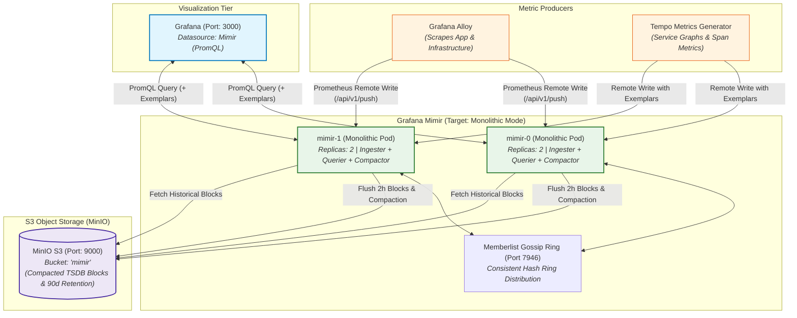

# ADR: Grafana Mimir Long-Term Metrics Storage & Scalability

## Status
Proposed (Future Architecture / Architectural Blueprint)

> **Note:** Mimir is not yet realized or active in the default local stack. Today, Prometheus serves as the metrics storage engine. This ADR documents the architectural blueprint, design decisions, and migration path (`task swap:mimir`) for replacing Prometheus with Mimir Monolithic HA when long-term S3-backed metrics retention is required.

---

## Context
A production-grade observability environment requires metric storage that can handle long-term retention (90+ days) and high availability. Standalone Prometheus is limited by local disk size and lacks a native horizontal scaling story for high-cardinality data. Requirements include:
- **S3-Native Metric Storage:** Pushing compacted metric blocks to S3-compatible object storage (MinIO) to remove local disk capacity constraints.
- **Horizontal Scalability:** Supporting horizontal scaling of ingestion and query paths with a low-overhead operational footprint.
- **Remote Write Compatibility:** Acting as a drop-in Prometheus Remote Write receiver for Grafana Alloy and Tempo Metrics Generator.
- **Exemplar Preservation:** Full retention and queryability of OpenTelemetry exemplars to enable seamless Metric-to-Trace navigation in Grafana.
- **Hash Ring Consistency:** Maintaining a consistent hash ring across replicas using Memberlist/Gossip for high availability without split-brain.

---

## Architecture & Data Flow (Target State)

### 1. Mimir Monolithic HA Ingestion & Query Flow


---

## Decision

1. **Deployment Mode: Monolithic Mode (`target: monolithic`):**
   - While Mimir can run as 10+ distinct microservices, the **Monolithic mode** runs all components (Ingester, Querier, Query Frontend, Compactor, Ruler, Store Gateway) inside a single container process.
   - Provides identical S3 durability and HA replication benefits with significantly lower resource overhead and zero microservice routing complexity for small-to-medium clusters.

2. **High Availability & Hash Ring (`memberlist`):**
   - Deploy **2 replicas** of the monolithic pod.
   - Use **Memberlist (Gossip protocol, port 7946)** to maintain a consistent hash ring across replicas.
   - Ingestion requests are replicated across the ring (`replication_factor: 2`), ensuring zero metric loss during pod rollouts.

3. **Storage Architecture & S3 Backend:**
   - **Backend:** MinIO S3 bucket `mimir` (`mimir.structuredConfig.common.storage.backend: s3`).
   - Like Loki and Tempo, Mimir writes immutable 2-hour TSDB blocks directly to S3. Local disk is used strictly as a short-term Write-Ahead Log (WAL) buffer.
   - **Compactor & Retention:** The built-in Mimir Compactor merges blocks and enforces a **90-day retention policy** by physically pruning expired blocks from the S3 bucket.

4. **Protocol & Exemplar Interoperability:**
   - Expose Prometheus Remote Write endpoint at `/api/v1/push`.
   - Preserve and index OpenTelemetry **Exemplars** (max exemplars configured) to allow Grafana to jump directly from Mimir metric spikes to Tempo traces.

5. **Surgical Swap Migration Strategy (`task swap:mimir`):**
   When transitioning from Prometheus to Mimir, the automated task performs the following lifecycle:
   ```powershell
   task swap:mimir FROM=dev TO=prod-local
   ```
   1. Uninstall the standalone Prometheus Helm release (`uninstall:prometheus`).
   2. Wipe and prepare the `mimir` bucket in MinIO via `./verification/storage-bootstrap.ps1 -wipe mimir`.
   3. Install Mimir via `helm upgrade --install mimir grafana/mimir-distributed` using `values-mimir.yaml`.
   4. Update Grafana datasources ConfigMap to redirect `Prometheus` queries to `http://mimir:8080/prometheus`.
   5. Restart Grafana deployment (`kubectl rollout restart deployment/grafana`).
   6. Execute verification suite (`./verification/verify-mimir.ps1`).

---

## Technical Specification Blueprint (Target Mapping)

| Component / Key | Planned Value | Purpose | Architectural Role |
| :--- | :--- | :--- | :--- |
| `target` | `monolithic` | Single-binary mode containing all Mimir microservices. | Topology |
| `replicas` | `2` | HA redundancy and rolling update survival. | Resiliency |
| `common.storage.backend` | `s3` | Object storage persistence without PVC size limitations. | Durability |
| `common.storage.s3.bucket` | `mimir` | Dedicated S3 bucket for TSDB metric blocks. | Storage Isolation |
| `memberlist.join_members` | `["mimir-memberlist"]` | Cluster-wide gossip discovery for consistent hash ring. | Coordination |
| `compactor.retention_enabled` | `true` | Physical pruning of blocks older than 90 days. | Cost Management |
| `limits.max_global_series_per_user` | `500000` | Ingestion guardrail against runaway cardinality. | Stability |
| `server.http_listen_port` | `8080` | Prometheus-compatible API & Remote Write ingestion. | Ingestion |
| `verification` | `verify-mimir.ps1` | Automated health, S3 bucket check, and PromQL query check. | Verification |

---

## Consequences

- **Positive:**
  - Virtually unlimited metric retention bounded only by object storage capacity.
  - Consistent PromQL compatibility across Grafana dashboards without altering queries.
  - Native Prometheus Remote Write receiver eliminates the need for separate Prometheus agents.
- **Negative:**
  - Increased cluster memory baseline compared to standalone Prometheus (requires at least 2Gi–4Gi per replica).
  - Memberlist Gossip protocol requires proper cluster DNS and firewall/network policy coordination.
- **Risk:**
  - Query latency for historical metrics is dependent on S3 GET latency; cold queries outside local cache may experience slight latency compared to local disk.
