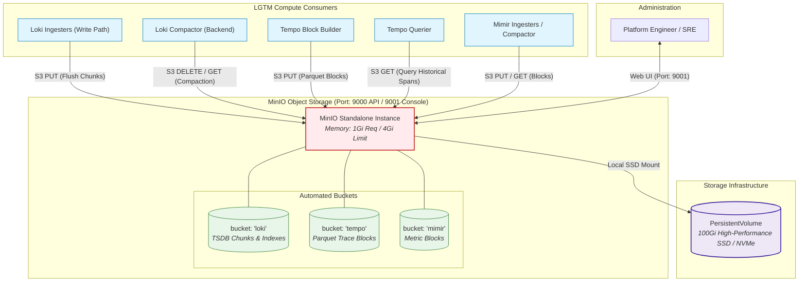

# ADR: MinIO S3-Compatible Object Storage Backend

## Status
Accepted

## Context
For on-premise and local Kubernetes deployments of the LGTM stack, an S3-compatible object storage layer is required. Decoupling long-term telemetry storage from compute pods guarantees durability, scalability, and cost efficiency. Key architectural requirements include:
- **S3 API Compatibility:** Providing a uniform, standardized storage interface for Loki (log chunks & indexes), Tempo (Parquet trace blocks), and Mimir (long-term metric blocks).
- **High I/O Throughput:** Sustaining concurrent writes and compaction operations without I/O blocking.
- **Reliable Lifecycle & Credentials:** Preventing credential rotation lockouts and automating bucket provisioning.

---

## Architecture & Storage Integration

### 1. MinIO Storage Topology Diagram
MinIO operates as the central object store backing all three primary persistence engines in the LGTM stack:

---

## Decision

1. **Deployment Mode:**
   - Deploy MinIO in **Standalone mode (`replicas: 1`)** backed by dedicated PersistentVolumes.
   - For on-premise single-cluster environments, standalone mode minimizes operational overhead while relying on underlying enterprise SSD/NVMe storage classes for disk-level durability.
   - In future enterprise phases with multi-node failure domains, MinIO can transition to a distributed 4-node deployment with Erasure Coding.

2. **Automated Bucket Provisioning:**
   - Configure Helm to automatically provision public/internal buckets on initial startup:
     - **`loki`:** Chunks, TSDB indexes, and ruler rules.
     - **`tempo`:** Columnar Parquet trace blocks and meta files.
     - **`mimir`:** Prometheus/Mimir long-term metric blocks.
   - Buckets are created idempotently with `purge: false` to prevent accidental deletion of existing telemetry data during chart upgrades.

3. **High-Performance SSD Persistence:**
   - Production instances allocate a minimum of **`100Gi`** PersistentVolumeClaim (`size: 100Gi`) backed by high-IOPS NVMe/SSD storage class (`50Gi` in sandbox dev).
   - High write throughput is essential to prevent back-pressure during bulk chunk flushes from Loki and Tempo.

4. **Deterministic Credential Management:**
   - Bind credentials via `existingSecret: minio-secret` referencing keys `rootUser: admin` and `rootPassword: password123`.
   - Prevents automated password regeneration during Helm releases which would break consumer authentication across Loki, Tempo, and Mimir.

5. **Resource Sizing for Metadata Caching:**
   - Allocate **`requests: cpu: 500m, memory: 1Gi`** and **`limits: memory: 4Gi`**.
   - Generous RAM allocation is required to allow MinIO to maintain S3 object listing caches in memory, preventing query timeouts during heavy background compaction jobs.

6. **Service Networking:**
   - Expose S3 API via ClusterIP service on port **`9000`** (`service.port: 9000`).
   - Expose Web Console via ClusterIP service on port **`9001`** (`consoleService.port: 9001`).

---

## Technical Specification & Implementation Mapping

This table maps the production implementation in `deployment/prod/values-minio.yaml` and `deployment/dev/values-minio.yaml` to the architectural decisions:

| Key / Path | Value / Configuration | Purpose | Architectural Role |
| :--- | :--- | :--- | :--- |
| `mode` | `standalone` | Simple, reliable single-instance object store. | Core Architecture |
| `replicas` | `1` | Focused footprint relying on underlying storage durability. | Topology |
| `persistence.enabled` | `true` | Ensures data survival across pod restarts. | Durability |
| `persistence.size` | `100Gi` (prod) / `50Gi` (dev) | Storage capacity for log, trace, and metric blocks. | Capacity |
| `existingSecret` | `minio-secret` | Decoupled, stable administrative credentials. | Security |
| `buckets` | `loki`, `tempo`, `mimir` | Automated bucket provisioning on startup. | Automation |
| `resources.requests` | `cpu: 500m, memory: 1Gi` | Baseline resources for S3 metadata operations. | Performance |
| `resources.limits` | `memory: 4Gi` | Headroom for S3 object listing cache. | Performance |
| `service.port` | `9000` (ClusterIP) | High-speed internal S3 API endpoint. | Ingress |
| `consoleService.port` | `9001` (ClusterIP) | Web administrative console for storage inspection. | Management |

---

## Consequences

- **Positive:**
  - Standardized S3 API decouples storage maintenance from compute instances.
  - Zero-maintenance bucket provisioning out of the box.
  - Consistent credential injection across all stack components via shared Kubernetes secrets.
- **Negative:**
  - Standalone mode has a single point of failure if the underlying Kubernetes worker node experiences hardware failure.
- **Risk:**
  - If SSD I/O bandwidth is saturated, ingestion workers (Loki Ingesters / Tempo Block Builder) will experience flush timeouts.
