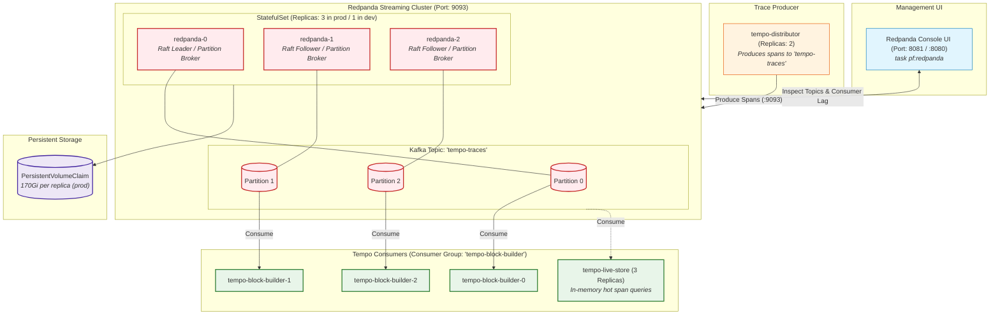

# ADR: Redpanda Streaming Log for Distributed Trace Ingestion

## Status
Accepted

## Context
In Tempo 3.x microservices mode, distributed trace ingestion decouples incoming OTLP span collection from Parquet block packaging. The architecture requires a high-performance, Kafka-compatible streaming log buffer to absorb traffic spikes, prevent data loss during object storage flushes, and provide partitioned span distribution across consumers.

Key requirements:
- **Kafka API Compatibility:** Standard Kafka protocol (`:9093`) without requiring separate ZooKeeper or JVM broker infrastructure.
- **Low Latency & High Throughput:** C++ native execution capable of handling high-volume trace stream writes.
- **Partitioned Distribution:** Support for partitioned topics (`tempo-traces` with 3 partitions) matching `tempo-block-builder` and `tempo-live-store` replicas.
- **Developer & Operator Visibility:** Integrated web console for inspecting topics, partitions, and consumer group lag.

---

## Architecture & Data Flow

### 1. Redpanda Trace Ingestion Buffer Topology

---

## Decision

1. **Technology Selection:** Deploy **Redpanda (Chart 26.2.1)** as the Kafka-compatible streaming log layer.
   - Redpanda is implemented in C++ and uses the Raft consensus algorithm directly, avoiding the JVM memory overhead and operational complexity of Apache Kafka + ZooKeeper / KRaft.

2. **Cluster Topology & High Availability:**
   - **Production:** 3-node StatefulSet (`statefulset.replicas: 3`) with Raft consensus across nodes.
   - **Dev / Sandbox:** 1-node StatefulSet (`statefulset.replicas: 1`) to conserve local Docker Desktop hardware resources.

3. **Topic & Partition Architecture:**
   - **Topic Name:** `tempo-traces` (auto-created via `config.cluster.auto_create_topics_enabled: true` or Tempo distributor).
   - **Partition Count:** Configured with **3 partitions** (`auto_create_topic_default_partitions: 3`).
   - The 3-partition topology matches the replica count of `tempo-block-builder` (3 replicas) and `tempo-live-store` (3 replicas), guaranteeing 1-to-1 partition consumer assignment with zero idle consumers.

4. **Persistence & Storage Sizing:**
   - **Production:** `storage.persistentVolume.enabled: true` with **`170Gi`** per node, ensuring sufficient disk headroom for high-throughput streaming WAL retention during downstream object storage maintenance.
   - **Dev:** Ephemeral storage (`storage.persistentVolume.enabled: false`) for lightweight local iteration.

5. **Operational UI & Observability:**
   - Deploy **Redpanda Console** (`console.enabled: true`) exposed on port `8080` internally and port-forwarded via `task pf:redpanda` to `http://localhost:8081`.
   - Used to verify consumer group offsets (`tempo-block-builder`), partition skew, and message throughput.
   - Disable anonymous usage reporting and phone-home telemetry (`rpk.enable_usage_stats: false`, `logging.usageStats.enabled: false`).

---

## Technical Specification & Implementation Mapping

| Key / Config Path | Production (`values-redpanda.yaml`) | Dev (`values-redpanda.yaml`) | Architectural Role |
| :--- | :--- | :--- | :--- |
| `statefulset.replicas` | `3` | `1` | Raft quorum and partition distribution. |
| `resources.cpu` | `1 core` | `100m` | Dedicated CPU per broker instance. |
| `resources.memory.container.max`| `2Gi` | `2Gi` | Memory ceiling per broker container. |
| `storage.persistentVolume.enabled` | `true` | `false` | Disk persistence across pod restarts. |
| `storage.persistentVolume.size` | `170Gi` | N/A | Log retention storage capacity. |
| `tls.enabled` | `false` | `false` | Plaintext internal cluster traffic. |
| `console.enabled` | `true` | `true` | Web UI for topic & consumer lag inspection. |
| `config.cluster.auto_create_topics_enabled` | `true` | `true` | Auto-creates `tempo-traces` on first publish. |
| `rpk.enable_usage_stats` | `false` | `false` | Airgapped / private telemetry compliance. |
| `logging.usageStats.enabled` | `false` | `false` | Disables anonymous phone-home statistics. |

---

## Consequences

- **Positive:**
  - High-throughput, low-latency streaming buffer that completely insulates trace ingestion from S3 storage latency.
  - Native Kafka protocol compatibility allows standard Kafka tools, CLI commands, and MCP servers (`kafka-mcp-server`) to inspect topics.
  - Zero JVM tuning or ZooKeeper management required.
- **Negative:**
  - In production, running a 3-broker StatefulSet with 170Gi PVCs per broker requires dedicated disk and memory allocation.
- **Risk:**
  - If `tempo-block-builder` consumers stall, Redpanda disk usage will grow proportionally to incoming trace volume until retention limits are reached.
