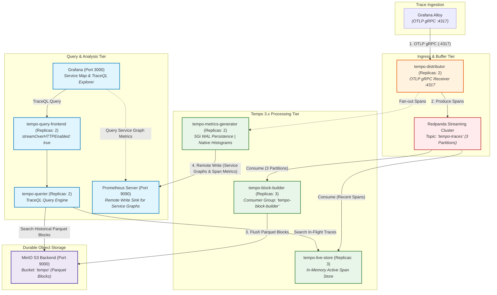

# ADR: Grafana Tempo Distributed Tracing (Tempo 3.x Architecture)

## Status
Accepted

## Context
Distributed tracing is the foundational pillar for microservice dependency mapping, latency troubleshooting, and error diagnosis. High cardinality and trace volume make storage and ingestion challenging. We require an architecture that:
- **Highly Available & Horizontally Scalable:** Capable of decoupling ingest spikes from object storage flush delays.
- **Cost-Effective & Columnar:** Long-term storage using S3-compatible object storage backed by Parquet format.
- **High-Performance:** Sub-second TraceQL queries and automated Service Graph generation.
- **Zero-Lag Searchability:** Making active in-flight traces queryable before S3 block compaction.

---

## Architecture & Streaming Data Flow

### 1. Tempo 3.x Microservices & Redpanda Pipeline Diagram
Tempo 3.x utilizes a streaming log architecture where incoming OTLP spans are buffered in **Redpanda (Kafka)** before being packaged into columnar Parquet blocks:

---

## Decision

1. **Deployment Mode (Tempo 3.x Microservices):**
   - Deploy via `grafana-community/tempo-distributed` (Chart 3.0.6) utilizing the **Tempo 3.x microservices model**.
   - Decouple ingestion from block construction via **Redpanda** as a streaming log buffer.

2. **Streaming Ingestion Tier (Redpanda + Block Builder):**
   - **Distributor (2 replicas):** Receives OTLP gRPC traffic on port `4317` and immediately streams spans to Redpanda.
   - **Kafka Topic:** Topic `tempo-traces` with **3 partitions** (`auto_create_topic_default_partitions: 3`).
   - **Block Builder (3 replicas):** Matches the 3 Kafka partitions. Operates under consumer group `tempo-block-builder` to continuously aggregate spans and flush columnar **Parquet** blocks to MinIO S3.
   - **Live Store (3 replicas):** Consumes recent spans from Redpanda to serve in-memory queries for active in-flight traces with zero latency. *(In resource-constrained `dev`, live-store can be scaled down or disabled to conserve single-node memory).*

3. **Storage Architecture & Columnar Parquet Format:**
   - **Backend:** MinIO S3 (`bucket: tempo`) with path-style access enabled.
   - **Columnar Format:** Exclusively build and store blocks in **Parquet** format, optimizing TraceQL search execution and compression.
   - **Credential Management:** Injected globally via `globalExtraEnv` referencing secret `minio` (`rootPassword` as `S3_SECRET_KEY`) with `-config.expand-env=true` passed to all components.

4. **Metrics-from-Traces (Service Graphs & Span Metrics):**
   - Deploy **`metricsGenerator` (2 replicas)** with dedicated **5Gi SSD persistence** for its local Write-Ahead Log (`/var/tempo/generator/wal`).
   - Enable processors: `service_graphs`, `span_metrics`, and `local_blocks`.
   - Export generated metrics via **Prometheus Remote Write** with `send_exemplars: true`.
   - Enable Prometheus native histograms (`generate_native_histograms: both`).

5. **Query Performance & Memory Optimization:**
   - Enable **`streamOverHTTPEnabled: true`** to stream trace search results over HTTP, preventing queryFrontend OOM crashes on large trace payloads.
   - Deploy **`queryFrontend` (2 replicas)** and **`querier` (2 replicas)** for high-throughput TraceQL query execution.

6. **Retention & Guardrails:**
   - Maintain a **14-day** retention policy on S3 object storage for production (7 days in sandbox).
   - Enforce a 60-second termination grace period (`terminationGracePeriodSeconds: 60`) on block-builder and metrics-generator to ensure unflushed WAL segments are committed to object storage prior to shutdown.

---

## Technical Specification & Implementation Mapping

This table maps the production implementation in `deployment/prod/values-tempo.yaml` and `deployment/prod-local/values-tempo.yaml` to the architectural decisions:

| Key / Component | Value / Configuration | Purpose | Architectural Role |
| :--- | :--- | :--- | :--- |
| `streamOverHTTPEnabled` | `true` | Lowers queryFrontend memory footprint via HTTP streaming. | Query Performance |
| `ingest.kafka.address` | `redpanda.monitoring.svc:9093` | Decouples OTLP ingest from block construction. | Buffer / Streaming |
| `ingest.kafka.topic` | `tempo-traces` (3 partitions) | Partitioned trace streaming buffer. | Ingestion Pipeline |
| `ingest.kafka.consumer_group`| `tempo-block-builder` | Durable Kafka consumer group offset tracking. | Ingestion Pipeline |
| `blockBuilder.replicas` | `3` | Exactly matches 3 Kafka partitions for balanced consumption. | Block Packaging |
| `liveStore.replicas` | `3` | Serves hot in-memory trace lookups without S3 polling lag. | Low-Latency Search |
| `distributor.replicas` | `2` (`receivers.otlp.grpc: 4317`)| High-availability OTLP trace reception. | Ingress |
| `querier.replicas` | `2` | Parallelized TraceQL query execution. | Query Tier |
| `queryFrontend.replicas` | `2` | Query scheduling, splitting, and result caching. | Query Tier |
| `storage.trace.backend` | `s3` (`bucket: tempo`) | Columnar Parquet long-term block persistence. | Durability |
| `metricsGenerator.enabled` | `true` (`replicas: 2`, `WAL: 5Gi`) | Automatic Service Graph and Span Metric derivation. | Observability |
| `metricsGenerator.remote_write`| Targets Prometheus with Exemplars | Pushes service dependency metrics to Prometheus. | Correlation |
| `overrides.generate_native_histograms`| `both` | Produces Prometheus sparse native histograms. | Metrics Efficiency |
| `globalExtraEnv` | `secretKeyRef: minio -> rootPassword` | Secure S3 credential expansion across all pods. | Security |

---

## Consequences

- **Positive:**
  - Redpanda streaming buffer prevents trace ingestion loss during sudden traffic bursts or MinIO latency spikes.
  - Automatic, real-time Service Graph generation in Grafana without manual instrumentation.
  - Parquet format delivers 5x–10x faster TraceQL query speeds compared to legacy formats.
  - Zero-lag queryability of hot spans via `liveStore`.
- **Negative:**
  - Higher operational footprint requiring Redpanda Kafka broker and consumer coordination.
  - Metrics generator requires local SSD WAL persistence (`5Gi`) to prevent metric loss during restarts.
- **Risk:**
  - Partition skew if traces are unevenly distributed across the 3 Kafka partitions.
