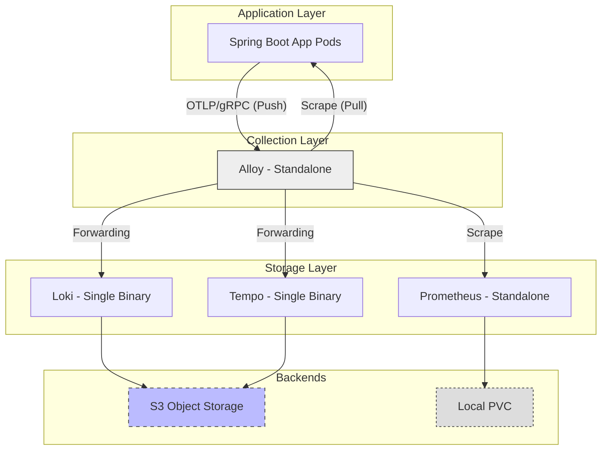
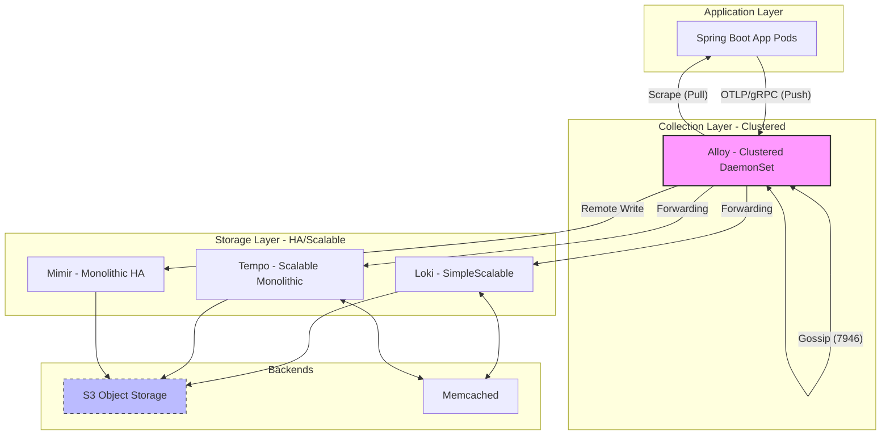

# System Architecture: Spring Boot LGTM Stack

This document serves as the high-level roadmap for the production observability stack, explaining how the components interact and where to find detailed decision rationales.

## 1. Stack Overview
We follow a **"Decoupled Ingestion & Storage"** pattern. Data enters through a decentralized **Alloy DaemonSet** layer, is processed for correlation (metadata enrichment) and cost management (tail-sampling), and is then routed to specialized backend stores.

## 1. Environment Architecture

### A. Development Sandbox (Dev)
Optimized for resource efficiency and rapid feedback loops.
- **Loki:** `SingleBinary` mode. No caching, minimal resource footprint.
- **Tempo:** `SingleBinary` mode (1 replica).
- **Mimir:** Standalone Prometheus instance (metrics).
- **Alloy:** Standalone (Non-clustered) deployment.
- **Persistence:** Local SSD PVCs (MinIO).

### B. Production / HA (Prod)
Optimized for durability, high-availability, and long-term retention.
- **Loki:** `SimpleScalable` mode. Includes distributed read/write/backend components, Memcached caching for queries/chunks, and replication factor of 3 (min 2 for sandbox HA validation).
- **Tempo:** `Scalable Monolithic` mode with 3 replicas (min 2 for sandbox HA validation), Memberlist gossip coordination, and Memcached-backed search.
- **Mimir:** Monolithic HA-ready deployment using S3 block storage.
- **Alloy:** Clustered DaemonSet (2+ replicas) with Gossip protocol enabled for trace affinity.
- **Persistence:** S3-native object storage (MinIO/AWS S3) with compactor-enforced physical retention.

## 2. Integrated Data Flow

### A. Development Sandbox (Dev)

### B. Production / HA (Prod)

## 3. Reference Documentation (The ADR Library)
This stack is governed by individual Architectural Decision Records (ADRs). Use these to understand the "Why" behind specific configuration settings:

| Component | Architecture Focus | ADR Link |
| :--- | :--- | :--- |
| **Grafana Alloy** | Collection, Enrichment, & Sampling | [alloy.md](./ADR/alloy.md) |
| **Grafana Loki** | Log Aggregation & Persistence | [loki.md](./ADR/loki.md) |
| **Grafana Tempo** | Distributed Traces & Metrics | [tempo.md](./ADR/tempo.md) |
| **Grafana Mimir** | Metrics Scalability | [mimir.md](./ADR/mimir.md) |

## 4. Operational Principles
- **Standardized Ingestion:** All components prioritize S3-native storage to separate compute from durability.
- **Trace Correlation:** Cross-stack navigation is enabled via mandatory `trace_id` promotion to Structured Metadata (Loki) and Exemplars (Mimir).
- **Production Guardrails:** Each component is locked to mandatory resource/cardinality limits defined in its respective ADR to prevent cluster instability.
- **Developer Lifecycle:** Local sandbox environments use optimized flush intervals (e.g., `chunk_idle_period: 30s` for Loki) to ensure data appears in verification scripts without production-scale wait times.
