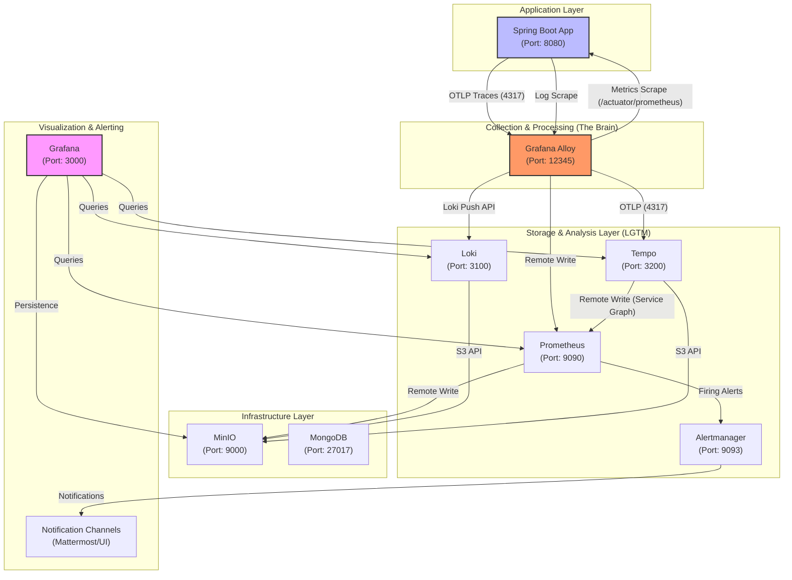

# Spring Boot LGTM Observability Sandbox

This project is a production-ready template and sandbox for implementing the **Grafana LGTM stack** (Loki, Grafana, Tempo, Mimir/Prometheus) with **Grafana Alloy** as the central observability gateway.

It demonstrates a "Scrape & Push" architecture using Spring Boot 3.5+, Micrometer Tracing (OTEL Bridge), and W3C Trace Context.

👉 **[Detailed Feature Guide (feature.md)](./feature.md)**
👉 **[Troubleshooting Guide (TROUBLESHOOT.md)](./TROUBLESHOOT.md)**

## 🚀 Key Features (Day 2 Ready)

This sandbox goes beyond basic connectivity to include advanced observability patterns:

- **Exemplars:** Direct correlation from metric spikes in Prometheus to specific traces in Tempo.
- **Baggage & Correlation:** Cross-service propagation of custom attributes (like `userId`) using W3C Baggage, synced automatically to logs (MDC) and traces (Span Attributes).
- **Kubernetes Enrichment:** Grafana Alloy automatically enriches every trace with Pod, Node, and Namespace metadata based on the source IP.
- **Embedded Debezium Monitoring:** Native Micrometer integration for Debezium Embedded, bridging JMX MBeans to Prometheus metrics without a Java Agent.
- **Tail-based Sampling:** Intelligent trace reduction (currently 100% for testing, configurable to keep 100% errors and X% success).
- **Service Graph:** Automated system-wide dependency mapping generated natively by Tempo.
- **Manual Instrumentation:** Examples of using the Micrometer `Observation` API for business-specific metrics and traces.
- **Self-Monitoring:** Integrated scraping of Alloy's own health and performance metrics.

## 🏗️ Architecture

The following diagram illustrates the data flow and communication ports across the LGTM stack:



- **Metrics:** Scraped by Alloy from `/actuator/prometheus` (Pull model).
- **Logs:** Collected by Alloy from pod stdout/stderr with Kubernetes metadata enrichment (Pull model).
- **Traces:** Pushed by the application to Alloy via OTLP/gRPC (Push model).
- **Correlation:** Data sources use standardized UIDs (`prometheus`, `loki`, `tempo`) to enable seamless cross-linking (Metric -> Trace -> Log).
- **Alloy:** Acts as the entry point, processing traces (sampling, batching) and extracting structured metadata before forwarding to Tempo and Loki.
- **Service Graph:** Generated natively by Tempo's internal `metricsGenerator` and pushed to Prometheus.
- **Scalability:** Loki runs in **Single Binary Mode** for resource efficiency in this sandbox. Tempo runs as a Single Binary as well.
- **Storage:** A local **MinIO** instance provides S3-compatible shared storage for **Loki**, while **Tempo** uses local Persistent Volumes (PVC) for simplicity and stability. **MongoDB** is deployed as a 3-node ReplicaSet (Primary, Secondary, Arbiter) with CDC enabled.

## 🛠️ Tech Stack & Versions

| Component           | Role              | Helm Chart                        | Version   |
|---------------------|-------------------|-----------------------------------|-----------|
| **Spring Boot 3.5** | Application       | -                                 | -         |
| **Grafana Alloy**   | Collector/Gateway | `grafana/alloy`                   | `1.6.1`   |
| **Grafana**         | Visualization     | `grafana-community/grafana`       | `11.3.0`  |
| **Loki**            | Log Storage       | `grafana-community/loki`          | `9.3.4`   |
| **Tempo**           | Trace Storage     | `grafana-community/tempo`         | `2.0.0`   |
| **Prometheus**      | Metrics Storage   | `prometheus-community/prometheus` | `28.13.0` |
| **MinIO**           | Object Storage    | `minio/minio`                     | `5.4.0`   |
| **MongoDB**         | DB / CDC Source   | `bitnami/mongodb` (OCI)           | `8.2.7`   |


## 🏁 Getting Started

The easiest way to deploy or upgrade the entire stack is using **Taskfile**. This automates the repository setup, namespace creation, and version-locking.

👉 **[Read the Full Installation & Upgrade Guide (INSTALL.md)](./deployment/INSTALL.md)**

### Quick Build & Deploy
```bash
# Install/Upgrade everything (Infra + App)
task all

# Or just the infrastructure (LGTM + Alloy)
task infra
```

## 🐳 Docker Desktop Notes

This project contains specialized configurations to handle hardware and mount propagation limits in Docker Desktop. 

👉 **[Read the Docker Desktop Configuration Guide (DOCKER_DESKTOP.md)](./DOCKER_DESKTOP.md)**

## 🔍 Exploration

1. **Generate Traces & Logs:** Call the Pokemon API with credentials to see correlation.
   ```bash
   curl -u user:password http://localhost:8080/pokemon/1
   ```
2. **Grafana Explore:** 
   - Search for `http_server_requests_seconds_bucket` to see **Exemplars** (clickable dots linking to traces).
   - Use the **Service Graph** tab in Tempo to see the automated architecture map.
   - Query Loki logs to see the `[service-name,traceId,spanId,userId]` correlation pattern.
3. **Custom Attributes:** 
   - Check Tempo span attributes for `user_id`, `deployment.environment`, and `k8s.pod.name`.
   - Check Loki Structured Metadata for `user_id`.
4. **Debezium Metrics:**
   - Search for `debezium_streaming_total_number_of_events_seen` in Prometheus to track CDC health.

## ⚙️ Production Tuning

When moving from this sandbox to a real production environment, consider the following adjustments:

### Service Graph (values-tempo.yaml)
The current settings are optimized for immediate feedback in a low-traffic sandbox. In production, Tempo's `metricsGenerator` ring should be backed by a persistent store like Etcd or memberlist.

### Tail-based Sampling (values-alloy.yaml)
The sandbox captures 100% of traces. In production, you should dial back the `probabilistic` sampling percentage (e.g., `1%` to `10%`) for successful requests while keeping `sample-errors` at 100%.

### Resource Attributes (deployment.yaml)
Custom attributes are set via `OTEL_RESOURCE_ATTRIBUTES`. In production, these should be dynamically populated via Helm values or CI/CD pipelines.
