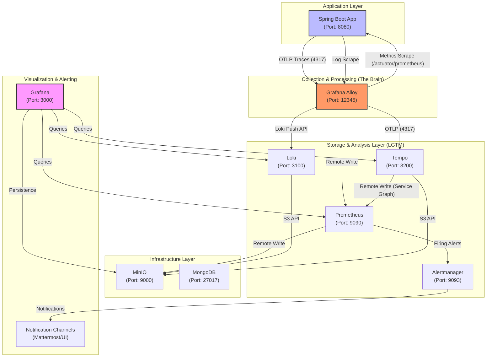

# Spring Boot LGTM Observability Sandbox

This project is a production-ready template and sandbox for implementing the **Grafana LGTM stack** (Loki, Grafana, Tempo, Mimir/Prometheus) with **Grafana Alloy** as the central observability gateway.

It demonstrates a "Scrape & Push" architecture using Spring Boot 3.5+, Micrometer Tracing (OTEL Bridge), and W3C Trace Context.

👉 **[Detailed Feature Guide (feature.md)](FEATURE.md)**
👉 **[Troubleshooting Guide (TROUBLESHOOT.md)](./TROUBLESHOOT.md)**

## 🚀 Key Features (Day 2 Ready)

This sandbox goes beyond basic connectivity to include advanced observability patterns:

- **Exemplars:** Direct correlation from metric spikes in Prometheus to specific traces in Tempo.
- **Baggage & Correlation:** Cross-service propagation of custom attributes (like `userId`) using W3C Baggage, synced automatically to logs (MDC) and traces (Span Attributes).
- **Kubernetes Enrichment:** Grafana Alloy automatically enriches every trace with Pod, Node, and Namespace metadata based on the source IP.
- **Embedded Debezium Monitoring:** Native Micrometer integration for Debezium Embedded, bridging JMX MBeans to Prometheus metrics without a Java Agent.
- **Tail-based Sampling:** Intelligent trace reduction (currently 100% for testing, configurable to keep 100% errors and X% success).
- **Service Graph:** Automated system-wide dependency mapping generated natively by Tempo.
- **Manual Instrumentation:** Examples of using the Micrometer `Observation` API for business-specific metrics and traces.
- **Self-Monitoring:** Integrated scraping of Alloy's own health and performance metrics.

## 🏗️ Architecture

The following diagram illustrates the data flow and communication ports across the LGTM stack:


```mermaid
graph TD
    subgraph "Application Layer"
        APP["Spring Boot App<br/>(Port: 8080)"]
    end

    subgraph "Collection & Processing (The Brain)"
        ALLOY["Grafana Alloy<br/>(Port: 12345)"]
    end

    subgraph "Storage & Analysis Layer (LGTM)"
        PROM["Prometheus<br/>(Port: 9090)"]
        LOKI["Loki<br/>(Port: 3100)"]
        TEMPO["Tempo<br/>(Port: 3200)"]
        AM["Alertmanager<br/>(Port: 9093)"]
    end

    subgraph "Infrastructure Layer"
        MINIO["MinIO<br/>(Port: 9000)"]
        MONGO["MongoDB<br/>(Port: 27017)"]
    end

    subgraph "Visualization & Alerting"
        GRAFANA["Grafana<br/>(Port: 3000)"]
        NOTIFY["Notification Channels<br/>(Mattermost/UI)"]
    end

    %% Data Flow: Application to Alloy
    APP -- "OTLP Traces (4317)" --> ALLOY
    APP -- "Log Scrape" --> ALLOY
    ALLOY -- "Metrics Scrape (/actuator/prometheus)" --> APP

    %% Data Flow: Alloy to Backends
    ALLOY -- "Remote Write" --> PROM
    ALLOY -- "Loki Push API" --> LOKI
    ALLOY -- "OTLP (4317)" --> TEMPO

    %% Storage Relationships
    PROM -- "Remote Write" --> MINIO
    LOKI -- "S3 API" --> MINIO
    TEMPO -- "S3 API" --> MINIO
    
    %% Internal Correlation & Alerting
    TEMPO -- "Remote Write (Service Graph)" --> PROM
    PROM -- "Firing Alerts" --> AM
    AM -- "Notifications" --> NOTIFY

    %% Visualization & Config
    GRAFANA -- "Queries" --> PROM
    GRAFANA -- "Queries" --> LOKI
    GRAFANA -- "Queries" --> TEMPO
    GRAFANA -- "Persistence" --> MINIO

    %% Styling
    style ALLOY fill:#f96,stroke:#333,stroke-width:2px
    style GRAFANA fill:#f9f,stroke:#333,stroke-width:2px
    style APP fill:#bbf,stroke:#333,stroke-width:2px
```

- **Metrics:** Scraped by Alloy from `/actuator/prometheus` (Pull model).
- **Logs:** Collected by Alloy from pod stdout/stderr with Kubernetes metadata enrichment (Pull model).
- **Traces:** Pushed by the application to Alloy via OTLP/gRPC (Push model).
- **Correlation:** Data sources use standardized UIDs (`prometheus`, `loki`, `tempo`) to enable seamless cross-linking (Metric -> Trace -> Log).
- **Alloy:** Acts as the entry point, processing traces (sampling, batching) and extracting structured metadata before forwarding to Tempo and Loki.
- **Service Graph:** Generated natively by Tempo's internal `metricsGenerator` and pushed to Prometheus.
- **Scalability:** Loki runs in **SimpleScalable** mode. Tempo runs in **Microservices Mode** (`tempo-distributed` 3.0.6) with **Redpanda** as the streaming ingestion log.
- **Storage:** MinIO provides S3-compatible shared storage for **Loki**, **Tempo**, and **Mimir**. **MongoDB** is deployed as a 3-node ReplicaSet with CDC enabled.

## 🛠️ Tech Stack & Versions

| Component           | Role              | Helm Chart                        | Version   |
|---------------------|-------------------|-----------------------------------|-----------|
| **Spring Boot 3.5** | Application       | -                                 | -         |
| **Grafana Alloy**   | Collector/Gateway | `grafana/alloy`                   | `1.8.1`   |
| **Grafana**         | Visualization     | `grafana-community/grafana`       | `12.1.1`  |
| **Loki**            | Log Storage       | `grafana-community/loki`          | `15.0.1`  |
| **Tempo**           | Trace Storage     | `grafana-community/tempo-distributed` | `3.0.6` |
| **Redpanda**        | Streaming Log     | `redpanda/redpanda`               | `26.2.1`  |
| **Prometheus**      | Metrics Storage   | `prometheus-community/prometheus` | `29.20.1` |
| **MinIO**           | Object Storage    | `minio/minio`                     | `5.4.0`   |
| **MongoDB**         | DB / CDC Source   | `bitnami/mongodb` (OCI)           | `18.6.31` |


## 🏁 Getting Started

The easiest way to deploy or upgrade the entire stack is using **Taskfile**. This automates the repository setup, namespace creation, and version-locking.

👉 **[Read the Full Installation & Upgrade Guide (INSTALLATION.md)](./INSTALLATION.md)**

### Quick Build & Deploy
```bash
# Install/Upgrade everything (Infra + App)
task all

# Or just the infrastructure (LGTM + Alloy)
task infra
```

## 🐳 Docker Desktop Notes

This project contains specialized configurations to handle hardware and mount propagation limits in Docker Desktop. 

👉 **[Read the Docker Desktop Configuration Guide (DOCKER_DESKTOP.md)](./DOCKER_DESKTOP.md)**

## 🔍 Exploration

1. **Generate Traces & Logs:** Call the Pokemon API with credentials to see correlation.
   ```bash
   curl -u user:password http://localhost:8080/pokemon/1
   ```
2. **Grafana Explore:** 
   - Search for `http_server_requests_seconds_bucket` to see **Exemplars** (clickable dots linking to traces).
   - Use the **Service Graph** tab in Tempo to see the automated architecture map.
   - Query Loki logs to see the `[service-name,traceId,spanId,userId]` correlation pattern.
   - Use the robust regex filter: `| regexp ".*\\[(?P<app>[^,]*),(?P<traceId>[^,]*),(?P<spanId>[^,]*),(?P<userId>[^,]*)\\].*"`
3. **Custom Attributes:** 
   - Check Tempo span attributes for `user_id`, `deployment.environment`, and `k8s.pod.name`.
   - Check Loki Structured Metadata for `user_id`.
4. **Debezium Metrics:**
   - Search for `debezium_streaming_total_number_of_events_seen` in Prometheus to track CDC health.

## ⚙️ Lifecycle Management

The stack follows a standardized lifecycle for every component (`alloy`, `loki`, `tempo`, `mimir`, `grafana`). Use these tasks to manage your environment:

| Action | Command | Description |
| :--- | :--- | :--- |
| **Deploy** | `task <component>` | Installs/Upgrades the component using Helm. |
| **Verify** | `task verify:<component> [ENV=prod] [MODE=full]` | Runs modular smoke-tests (ENV: dev/prod, MODE: full/semi). |
| **Uninstall**| `task uninstall:<component>` | Removes the component and its persistent storage. |

*Example: Manage Alloy*
```bash
task alloy              # Deploy/Upgrade
task verify:alloy       # Validate status and config
task uninstall:alloy    # Clean up
```

## ⚙️ Moving to Production

This project includes a production-hardened framework. When migrating from the local sandbox to a production cluster, do not rely on manual tuning; instead, follow the formal architecture and requirements documentation:

👉 **[System Architecture (ARCHITECTURE.md)](./ARCHITECTURE.md)**
👉 **[Component-Specific Decisions (ADR/)](./ADR/)**
👉 **[Production Requirements (REQUIREMENTS.md)](./REQUIREMENTS.md)**

## Upgrading

This [repo](https://grafana-community.github.io/helm-charts/changelog/?owner=grafana-community&repo=helm-charts&chart=loki) provide changelog across helm chart version, making it easy to understand the changes, and to perform the upgrade
