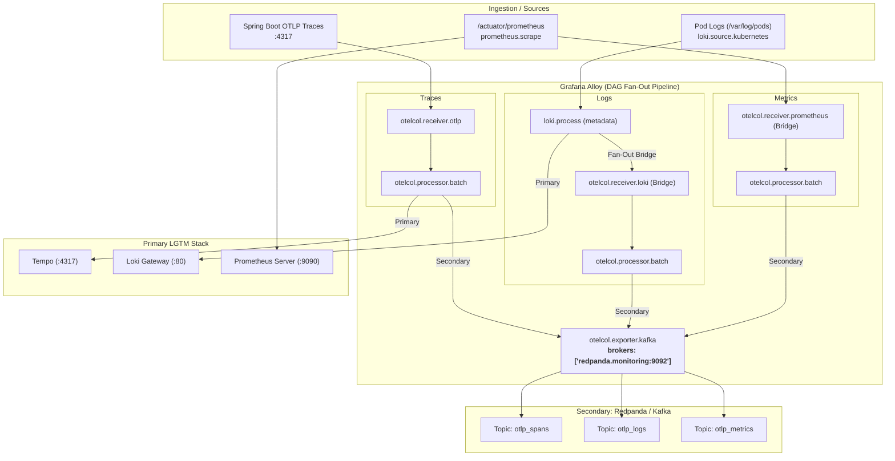
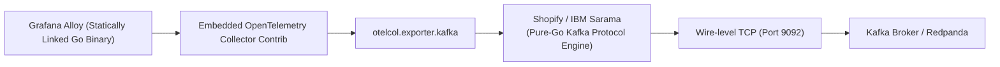

# 🔀 Publishing Telemetry from Grafana Alloy to Multiple Sources (Kafka/Redpanda)

This guide outlines the architectural pattern for fanning out telemetry signals (**Traces**, **Logs**, and **Metrics**) collected by Grafana Alloy to a secondary destination—specifically a Kafka-compatible streaming message broker such as **Redpanda**—alongside our primary LGTM storage (Tempo, Loki, and Prometheus).

---

## 🎯 Motivation & Use Cases

1. **Dual-Shipping for Migration / Zero-Downtime Cutover:** Stream live telemetry to both the existing LGTM stack and a staging/eval environment without modifying application code.
2. **Enterprise SIEM / Long-Term Data Lake Archival:** Feed raw logs or OTel events directly to Kafka topics consumed by corporate compliance pipelines, Splunk, Elastic, or Snowflake/BigQuery.
3. **Real-Time Stream Processing & Anomaly Detection:** Run Apache Flink, Faust, or custom stream-processing workers against live Kafka topics to detect fraudulent requests, high latency spikes, or security anomalies before metrics are even aggregated.

---

## 🏗️ Architecture & Signal Fan-Out

Grafana Alloy’s River configuration models ingestion as a **Directed Acyclic Graph (DAG)**. Fan-out is accomplished by including multiple downstream targets in a component’s `forward_to` or `output` block.



---

## 🧩 Signal Transformation & Bridges

Because our primary stack ingests different native protocols, Alloy provides bridge components to convert between ecosystem formats and OpenTelemetry:

| Telemetry Signal | Origin Component | Native Target | Conversion Bridge Required for Kafka | Kafka Topic |
| :--- | :--- | :--- | :--- | :--- |
| **Traces** | `otelcol.receiver.otlp` | `otelcol.exporter.otlp.tempo` | None (already native OTel) | `otlp_spans` |
| **Logs** | `loki.source.kubernetes` | `loki.write.local` (Loki API) | `otelcol.receiver.loki` (converts Loki entries to OTel logs) | `otlp_logs` |
| **Metrics** | `prometheus.scrape` | `prometheus.remote_write.prom` | `otelcol.receiver.prometheus` (converts Prom metrics to OTel metrics) | `otlp_metrics` |

---

## 📝 River Configuration Blueprint

Below is the complete snippet demonstrating how to extend `values-alloy.yaml` to enable fan-out to our internal Redpanda broker (`redpanda.monitoring.svc.cluster.local:9092`):

```river
// =============================================================================
// 1. KAFKA EXPORTER (REDPANDA)
// =============================================================================
otelcol.exporter.kafka "redpanda" {
  brokers          = ["redpanda.monitoring.svc.cluster.local:9092"]
  protocol_version = "3.4.0"

  // Target Kafka topics
  topic_traces  = "otlp_spans"
  topic_metrics = "otlp_metrics"
  topic_logs    = "otlp_logs"

  // Encoding format: "otlp_proto" (default binary protobuf) or "otlp_json"
  // Note: otlp_proto is optimal for high throughput and compact serialization
}

// =============================================================================
// 2. TRACES PIPELINE (Direct Fan-Out)
// =============================================================================
otelcol.receiver.otlp "default" {
  grpc { endpoint = "0.0.0.0:4317" }
  output { traces = [otelcol.processor.k8sattributes.default.input] }
}

otelcol.processor.k8sattributes "default" {
  extract {
    metadata = ["k8s.pod.name", "k8s.namespace.name", "k8s.node.name"]
  }
  output { traces = [otelcol.processor.batch.traces.input] }
}

otelcol.processor.batch "traces" {
  output {
    // Fan out to BOTH Tempo and Redpanda
    traces = [
      otelcol.exporter.otlp.tempo.input,
      otelcol.exporter.kafka.redpanda.input,
    ]
  }
}

otelcol.exporter.otlp "tempo" {
  client {
    endpoint = "tempo-distributor.monitoring.svc.cluster.local:4317"
    tls { insecure = true }
  }
}

// =============================================================================
// 3. LOGS PIPELINE (Loki -> OTel Bridge Fan-Out)
// =============================================================================
loki.process "extract_metadata" {
  // Fan out: write to Loki AND feed the OTel bridge
  forward_to = [
    loki.write.local.receiver,
    otelcol.receiver.loki.bridge.receiver,
  ]

  stage.regex {
    expression = ".*\\[(?P<app>[^,]*),(?P<traceId>[^,]*),(?P<spanId>[^,]*),(?P<userId>[^,]*)\\].*"
  }

  stage.structured_metadata {
    values = {
      "trace_id" = "traceId",
      "span_id"  = "spanId",
      "user_id"  = "userId",
    }
  }

  stage.label_drop {
    values = ["app", "traceId", "spanId", "userId"]
  }
}

// Bridge component: turns Loki stream logs into OTel log records
otelcol.receiver.loki "bridge" {
  output {
    logs = [otelcol.processor.batch.logs.input]
  }
}

otelcol.processor.batch "logs" {
  output {
    logs = [otelcol.exporter.kafka.redpanda.input]
  }
}

// =============================================================================
// 4. METRICS PIPELINE (Prometheus Scrape -> OTel Bridge Fan-Out)
// =============================================================================
prometheus.scrape "spring_boot" {
  targets = discovery.relabel.spring_boot_pods.output
  // Fan out: Remote write to Prometheus AND feed OTel bridge
  forward_to = [
    prometheus.remote_write.prom.receiver,
    otelcol.receiver.prometheus.bridge.receiver,
  ]
}

// Bridge component: turns Prometheus samples into OTel metrics
otelcol.receiver.prometheus "bridge" {
  output {
    metrics = [otelcol.processor.batch.metrics.input]
  }
}

otelcol.processor.batch "metrics" {
  output {
    metrics = [otelcol.exporter.kafka.redpanda.input]
  }
}
```

---

## ⚙️ Operational Considerations

### 1. Topic Creation & Auto-Provisioning
In our Redpanda Helm configuration (`deployment/dev/values-redpanda.yaml`), `config.cluster.auto_create_topics_enabled: true` is enabled. As soon as Alloy begins publishing, Redpanda will automatically create the topics (`otlp_spans`, `otlp_metrics`, `otlp_logs`) with cluster defaults (typically 1 partition in dev, 3 in prod).

### 2. Backpressure & Failure Isolation
- `otelcol.processor.batch` buffers records and flushes on batch size or timeout.
- If Redpanda or Kafka becomes unavailable, the Kafka exporter will retry and eventually drop records once memory/buffer queues fill up, **preventing a backpressure stall on the primary Prometheus/Loki/Tempo ingestion pathways**.
- In high-throughput production environments, assign dedicated `otelcol.processor.batch` queues for each exporter to guarantee total isolation.

### 3. Authentication & Security
For external enterprise Kafka brokers:
```river
otelcol.exporter.kafka "enterprise" {
  brokers = ["kafka.corp.internal:9092"]
  auth {
    sasl {
      mechanism = "SCRAM-SHA-512"
      username  = "alloy-telemetry"
      password  = sys.env("KAFKA_SECRET")
    }
    tls {
      ca_pem = file("/etc/alloy/certs/ca.pem")
    }
  }
}
```

---

## 🔍 Deep Dive: How Alloy Speaks to Kafka Internally

### 1. Does Alloy require an external driver or client library?
**No.** Alloy is distributed as a single, statically compiled Go binary. It has **no external driver, Java jar, or C/librdkafka dependencies**.

The internal architecture relies on pure-Go implementations embedded into Alloy:



### 2. Export Lifecycle
1. **Batching:** `otelcol.processor.batch` groups traces, logs, or metrics into batches (by count or buffer timeout) to maximize network throughput and minimize Kafka producer overhead.
2. **Serialization (Encoding):**
   - `otlp_proto` (Default): Encodes the telemetry batch directly into OpenTelemetry Protocol Buffers (protobuf) binary format.
   - `otlp_json`: Encodes the batch into standard OTLP JSON string payloads for human readability or generic JSON consumers.
3. **Partition Keying:**
   - Traces are keyed by `TraceID` so all spans for a specific trace land on the same Kafka partition.
   - Logs and metrics can be round-robined or partitioned by resource attributes.
4. **Publishing:** The embedded producer maintains an in-memory ring-buffer with automated retry backoff, compression (`gzip`, `snappy`, `lz4`, `zstd`), and configurable write acknowledgment (`acks`).

---

## 📊 Scraping Kafka/Redpanda Metrics via Built-in `prometheus.exporter.kafka`

Because Alloy has `prometheus.exporter.kafka` baked directly into the binary, **you do NOT need to deploy an external `kafka-exporter` pod or sidecar**!

Alloy can connect directly to your Kafka or Redpanda brokers, collect cluster health, topic partition offsets, and consumer group lags, and route those metrics directly into your Prometheus storage.

### 1. Alloy River Configuration Example

```river
// Embedded Kafka Exporter: Scrapes topic offsets and consumer lag directly
prometheus.exporter.kafka "redpanda" {
  kafka_uris = ["redpanda.monitoring.svc.cluster.local:9092"]
  
  // Optional filters to avoid scraping unwanted internal topics:
  // topic_filter = ".*"
  // group_filter = ".*"
}

// Scrape the embedded exporter and forward metrics to Prometheus
prometheus.scrape "redpanda_metrics" {
  targets    = prometheus.exporter.kafka.redpanda.targets
  forward_to = [prometheus.remote_write.prom.receiver]
}
```

### 2. Crucial Redpanda vs Standard Kafka Note

- **Standard Kafka (Java):** Exposes consumer lag and topic stats via TCP, but JVM internals require a separate JMX scraper. The embedded `prometheus.exporter.kafka` is the primary way to get consumer lag into Prometheus without JMX.
- **Redpanda (C++):** Redpanda **already natively exposes Prometheus metrics** directly on port `:9644/public_metrics` and `:9644/metrics` without needing any exporter!
  - You can scrape Redpanda's native port (`:9644`) directly via `prometheus.scrape`.
  - Alternatively, you can point Alloy's `prometheus.exporter.kafka` at Redpanda's Kafka port (`:9092`), and it will query consumer group lag using the standard Kafka AdminClient protocol.

### 3. Summary of Built-in Kafka Components in Alloy

| Component | Direction | Purpose | Needs Extra Pod/Container? |
| :--- | :--- | :--- | :--- |
| **`otelcol.exporter.kafka`** | Outbound | Pushes OTel traces, logs, and metrics **TO** Kafka topics | ❌ No (Built into Alloy) |
| **`otelcol.receiver.kafka`** | Inbound | Consumes OTel telemetry **FROM** Kafka topics into Alloy pipelines | ❌ No (Built into Alloy) |
| **`prometheus.exporter.kafka`** | Inbound / Scrape | Scrapes broker partition offsets & consumer lag via Kafka wire protocol | ❌ No (Replaces external `kafka-exporter` container) |

---

## 🧪 Validation Checklist (For Future Implementation)

- [ ] Add the Kafka exporter and bridge blocks to `deployment/dev/values-alloy.yaml`.
- [ ] Upgrade Alloy release: `task alloy` (or `task use:alloy`).
- [ ] Verify topics are created in Redpanda Console (`task pf:redpanda` -> http://localhost:8081):
  - Check for `otlp_spans`, `otlp_logs`, and `otlp_metrics`.
- [ ] Validate message consumption via Redpanda Console UI or `rpk topic consume otlp_spans`.
- [ ] Verify no disruption to primary dashboards in Grafana for Prometheus, Loki, or Tempo.
