# 📜 Forwarding Logs to/from Syslog in Grafana Alloy

This document explores how Grafana Alloy handles Syslog data—both **forwarding logs outward to an external Syslog server** (e.g. enterprise SIEM, rsyslog, Splunk Universal Forwarder) and **receiving Syslog inward** into the LGTM stack.

---

## 🎯 The Core Question

> *"Is it possible to forward application/cluster logs to Syslog directly from Grafana Alloy?"*

**Yes.** Grafana Alloy natively includes the OpenTelemetry Collector Syslog components, enabling direct egress to Syslog servers using RFC 5424 or RFC 3164 standards over TCP or UDP, with **zero external agents, drivers, or daemon dependencies**.

---

## 🏗️ Architecture: Two Operational Scenarios

```mermaid
flowchart TD
    subgraph Scenario1 ["Scenario A: Outbound Egress (Exporting Application Logs to Syslog)"]
        APP_LOGS["App / Pod Logs (/var/log/pods)<br/>loki.source.kubernetes"]
        LOKI_PROC["loki.process (extract metadata)"]
        LOKI_WRITE["loki.write (Loki Gateway)"]
        BRIDGE["otelcol.receiver.loki (Bridge)"]
        BATCH["otelcol.processor.batch"]
        SYSLOG_EXP["otelcol.exporter.syslog<br/><i>protocol: rfc5424 / tcp</i>"]
        EXT_SYSLOG[("External Syslog Server / SIEM<br/>:514 or :1514")]

        APP_LOGS --> LOKI_PROC
        LOKI_PROC -->|Primary| LOKI_WRITE
        LOKI_PROC -->|Fan-Out Bridge| BRIDGE --> BATCH --> SYSLOG_EXP --> EXT_SYSLOG
    end

    subgraph Scenario2 ["Scenario B: Inbound Ingest (Receiving Network Syslog into Loki)"]
        NET_DEVICES["Network Devices / Appliances / OS"]
        SYSLOG_SRC["loki.source.syslog<br/><i>port: 1514 / tcp or udp</i>"]
        LOKI_DEST["loki.write (Loki Gateway)"]

        NET_DEVICES -->|Syslog stream| SYSLOG_SRC --> LOKI_DEST
    end
```



---

## 🚀 Scenario A: Outbound Forwarding (Pod Logs → Syslog Server)

When an enterprise compliance or security mandate requires container/application logs to be forwarded to a centralized Syslog daemon (or legacy SIEM), Alloy can fan-out logs directly.

### 1. How It Works
1. `loki.source.kubernetes` tails container logs from `/var/log/pods`.
2. `loki.process` extracts trace metadata (`trace_id`, `span_id`, `user_id`).
3. Logs are written to **Loki** as the primary storage.
4. Concurrently, logs are bridged to OpenTelemetry format using **`otelcol.receiver.loki`**.
5. **`otelcol.exporter.syslog`** formats the OTel log records into standard RFC 5424 Syslog frames and sends them over TCP/UDP to the remote Syslog server.

### 2. River Configuration Blueprint

```river
// --- Primary Loki Processing ---
loki.process "extract_metadata" {
  forward_to = [
    loki.write.local.receiver,            // Primary: to Loki Gateway
    otelcol.receiver.loki.bridge.receiver // Fan-Out: bridge to Syslog
  ]

  stage.regex {
    expression = ".*\\[(?P<app>[^,]*),(?P<traceId>[^,]*),(?P<spanId>[^,]*),(?P<userId>[^,]*)\\].*"
  }

  stage.structured_metadata {
    values = {
      "trace_id" = "traceId",
      "span_id"  = "spanId",
      "user_id"  = "userId",
    }
  }

  stage.label_drop {
    values = ["app", "traceId", "spanId", "userId"]
  }
}

// --- Bridge Loki Logs to OpenTelemetry Format ---
otelcol.receiver.loki "bridge" {
  output {
    logs = [otelcol.processor.batch.syslog.input]
  }
}

otelcol.processor.batch "syslog" {
  output {
    logs = [otelcol.exporter.syslog.remote_syslog.input]
  }
}

// --- Outbound Syslog Exporter ---
otelcol.exporter.syslog "remote_syslog" {
  endpoint = "syslog.corp.internal:514"
  network  = "tcp"            // "tcp" or "udp"
  protocol = "rfc5424"        // Modern IETF standard (supports structured data & timestamps)
  
  // Optional TLS configuration for secure transport:
  // tls {
  //   insecure = false
  //   ca_file  = "/etc/alloy/certs/syslog-ca.crt"
  // }
}
```

### 3. Syslog Field Mapping in `otelcol.exporter.syslog`
* **Timestamp**: Preserved from the original log timestamp (nanosecond resolution in RFC 5424).
* **Hostname**: Automatically set from the `k8s.pod.name` or `host.name` resource attribute.
* **App-Name**: Extracted from `service_name` or `app` label.
* **Message**: The formatted log body, including MDC correlation headers.

---

## 🔍 Filtering What Gets Exported to Syslog

When dual-shipping logs to an external Syslog or SIEM, you typically **do not want to ship all noisy debug or heartbeat logs**. Alloy provides powerful filtering mechanisms at two points in the pipeline:

### 1. In the OTel Pipeline: `otelcol.processor.filter` (Recommended)

Because the Syslog exporter is downstream of the bridge (`otelcol.receiver.loki`), you can insert an **`otelcol.processor.filter`** directly before the Syslog batcher. This filters logs **only for Syslog** without affecting what gets stored in Loki!

It uses the standard **OpenTelemetry Transformation Language (OTTL)**:

```river
otelcol.processor.filter "syslog_filter" {
  error_mode = "ignore"

  // OTTL conditions: if any condition evaluates to true, the log record is DROPPED
  log_record = [
    // 1. Drop noisy levels: Only allow WARN and ERROR into Syslog
    `severity_number < 13`, // 1-8: Trace/Debug, 9-12: Info, 13-16: Warn, 17-20: Error

    // 2. Drop health-check / actuator noise
    `IsMatch(body, ".*actuator/health.*")`,
    `IsMatch(body, ".*actuator/prometheus.*")`,

    // 3. Drop specific noisy namespaces or pods
    `resource.attributes["k8s.namespace.name"] == "kube-system"`,

    // 4. Drop non-business workloads (e.g. only forward our spring-boot-app)
    `resource.attributes["service.name"] != "spring-boot-app"`,
  ]

  output {
    logs = [otelcol.processor.batch.syslog.input]
  }
}
```

#### Pipeline Wiring with Filter:
```
otelcol.receiver.loki "bridge" 
   → otelcol.processor.filter "syslog_filter" 
   → otelcol.processor.batch "syslog" 
   → otelcol.exporter.syslog "remote_syslog"
```

---

### 2. Types of Filters You Can Define (OTTL Capabilities)

| Filter Category | OTTL Expression Example | Use Case |
| :--- | :--- | :--- |
| **Log Level / Severity** | ``severity_text == "DEBUG"`` or ``severity_number < 13`` | Only ship warnings, errors, or security events to SIEM |
| **Message Regex / Substring** | ``IsMatch(body, ".*password.*")`` or ``IsMatch(body, ".*health.*")`` | Drop routine health checks or strip unwanted patterns |
| **Kubernetes Metadata** | ``resource.attributes["k8s.namespace.name"] != "prod"`` | Only forward production namespace logs |
| **Service / App Name** | ``resource.attributes["service.name"] == "noisy-crawler"`` | Exclude specific noisy microservices |
| **User / MDC Attribute** | ``attributes["user_id"] == nil`` or ``attributes["user_id"] == ""`` | Only forward logs associated with authenticated user actions |
| **Trace Correlation** | ``trace_id.string == ""`` | Only forward logs that belong to a distributed trace |

---

### 2.1 Dedicated MDC Marker Pattern (e.g. `for-syslog=true`)

You can define an explicit marker in application code (or via SLF4J MDC) so that **only intentionally marked logs** leave the cluster to Syslog.

There are two primary approaches depending on how you inject the marker:

#### Approach A: Structured MDC Attribute via Baggage (Cleanest)
1. Add `forSyslog` (or `exportTarget`) to `management.tracing.baggage.correlation.fields` in `application.yaml`:
   ```yaml
   management:
     tracing:
       baggage:
         correlation:
           fields: [userId, forSyslog]
   ```
2. In Java code, set the MDC marker:
   ```java
   MDC.put("forSyslog", "true");
   log.info("Security audit event: password changed for user {}", userId);
   MDC.remove("forSyslog");
   ```
3. In `loki.process "extract_metadata"`, capture it into Structured Metadata:
   ```river
   stage.regex {
     // Capture [app,traceId,spanId,userId,forSyslog]
     expression = ".*\\[(?P<app>[^,]*),(?P<traceId>[^,]*),(?P<spanId>[^,]*),(?P<userId>[^,]*),(?P<forSyslog>[^,]*)\\].*"
   }
   stage.structured_metadata {
     values = {
       "for_syslog" = "forSyslog",
     }
   }
   ```
4. In `otelcol.processor.filter`, **drop everything that lacks the marker**:
   ```river
   otelcol.processor.filter "syslog_filter" {
     error_mode = "ignore"
     log_record = [
       // Drop any log that does NOT have for_syslog == "true"
       `attributes["for_syslog"] != "true"`,
     ]
   }
   ```

#### Approach B: Inline Log Marker / SLF4J Marker (Zero Config Changes)
If you don't want to modify log patterns or baggage configs, use SLF4J Markers directly in code:
```java
private static final Marker SYSLOG_MARKER = MarkerFactory.getMarker("FOR_SYSLOG");

log.warn(SYSLOG_MARKER, "Audit alert: unauthorized access attempt from IP {}", clientIp);
```
Logback prints markers into the log body (e.g. `[FOR_SYSLOG] Audit alert...`). Then filter directly on the log body using OTTL:
```river
otelcol.processor.filter "syslog_filter" {
  error_mode = "ignore"
  log_record = [
    // Drop all logs that do NOT contain [FOR_SYSLOG] or [for-syslog]
    `not IsMatch(body, ".*\\[FOR_SYSLOG\\].*")`,
  ]
}
```
This requires **zero changes to Alloy's regex stages** and drops all unmarked logs instantly.

---

### 3. Alternative: Pre-Filtering in Loki Pipeline (`loki.process`)

If you want to drop logs **before** they even reach either Loki or the bridge:

```river
loki.process "extract_metadata" {
  // Drop logs matching regex entirely from the cluster:
  stage.drop {
    expression = ".*actuator/health.*"
  }
}
```

> **Design Rule:**
> - To filter **only what goes to Syslog** (keeping full logs in Loki) → Use **`otelcol.processor.filter`** after the bridge.
> - To filter **globally** (drop from both Loki and Syslog) → Use **`stage.drop`** in `loki.process`.


## 📥 Scenario B: Inbound Ingest (Network Devices → Loki)

If the requirement is the reverse—ingesting syslog events emitted by firewalls, routers, or legacy VMs into Loki—Alloy provides **`loki.source.syslog`**.

### River Configuration:

```river
loki.source.syslog "syslog_receiver" {
  listener {
    address  = "0.0.0.0:1514"
    protocol = "tcp"
    labels   = { component = "network-syslog" }
  }

  listener {
    address  = "0.0.0.0:1514"
    protocol = "udp"
    labels   = { component = "network-syslog" }
  }

  forward_to = [loki.write.local.receiver]
}
```

> **Note on Port Numbers:** Ports `< 1024` (such as default `:514`) require `CAP_NET_BIND_SERVICE` Linux capabilities in Kubernetes. Using an unprivileged high port (e.g. `:1514` or `:8514`) mapped via a Kubernetes Service (`type: LoadBalancer` or `NodePort`) is recommended.

---

## ⚖️ Trade-offs & Comparisons

| Approach | Pros | Cons | Recommendation |
| :--- | :--- | :--- | :--- |
| **Direct via `otelcol.exporter.syslog`** | • Single agent architecture (Alloy does everything)<br>• Zero extra sidecars or Daemons<br>• Shares same batching & buffer queues | • Syslog protocol adds serialization overhead compared to native gRPC<br>• UDP has risk of silent drop on network congestion | ✅ **Best choice** for forwarding specific pod logs to an enterprise SIEM. |
| **Intermediate Forwarder (Vector / Fluentbit)** | • Highly optimized text formatting pipelines<br>• Dedicated disk-backed ring buffers | • Adds an extra deployment and maintenance layer to the cluster | ⚠️ Only needed if enterprise syslog ingestion rate exceeds 50,000 logs/sec. |
| **Application-level Syslog Appender** | • Directly sends from Logback/Log4j2 via TCP/UDP | • Hardcoded app configuration<br>• Can block app threads if syslog server is unreachable | ❌ **Anti-pattern** for Kubernetes; logs should always be written to stdout. |

---

## 📋 Summary

1. Forwarding logs directly to a Syslog server from Grafana Alloy **is fully supported**.
2. It uses the built-in **`otelcol.exporter.syslog`** component backed by **`otelcol.receiver.loki`** to bridge from Loki's log format into OpenTelemetry's pipeline.
3. Both **RFC 5424** (modern) and **RFC 3164** (legacy BSD) formats are supported over TCP and UDP.
4. No third-party drivers or additional pods are needed.
