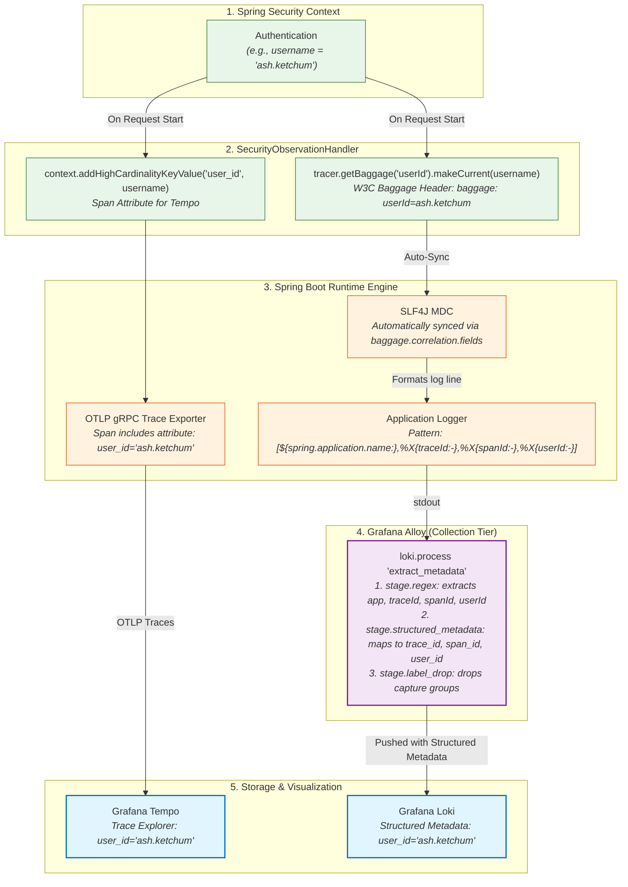

# 🏷️ Custom Attributes, Baggage & MDC Correlation Guide

This guide explains how **Span Attributes**, **W3C Baggage**, **SLF4J MDC (Mapped Diagnostic Context)**, and **Loki Structured Metadata** work together in this Spring Boot 3.5 observability sandbox to provide end-to-end trace-to-log-to-user correlation without manual boilerplate.

---

## 🧭 The Core Problem & Our Strategy

In distributed microservices, business attributes (e.g. `userId`, `tenantId`, `orderId`) need to be:
1. **Searchable in Traces** (Tempo Span Attributes).
2. **Propagated across HTTP/gRPC network hops** (W3C Baggage).
3. **Injected into every application log line** (SLF4J MDC).
4. **Searchable in Logs without label cardinality explosion** (Loki Structured Metadata).

We adopt a standard naming convention:
- **Idiomatic Java / Log pattern:** `camelCase` (e.g. `userId`, `traceId`, `spanId`).
- **LGTM Observability Standard:** `snake_case` (e.g. `user_id`, `trace_id`, `span_id`).

---

## 🔄 End-to-End Correlation Architecture



---

## ⚙️ Configuration Deep-Dive

### 1. Spring Boot `application.yaml` Configuration

```yaml
management:
  tracing:
    enabled: true
    sampling:
      probability: 1.0 # 100% head-sampling; Alloy tail-sampling reduces in prod
    propagation:
      produce: [w3c]   # Emits W3C traceparent and baggage headers
      consume: [w3c]   # Accepts incoming W3C traceparent and baggage headers
    baggage:
      enabled: true
      remote-fields:
        - userId       # W3C Baggage header: travels across HTTP service boundaries
      correlation:
        enabled: true
        fields:
          - userId     # Automatically synchronizes the baggage field to SLF4J MDC!

logging:
  pattern:
    # Standard format: [app-name,traceId,spanId,userId]
    correlation: "[${spring.application.name:},%X{traceId:-},%X{spanId:-},%X{userId:-}]"
  include-application-name: false
```

#### How the correlation fields sync to MDC:
- `management.tracing.baggage.remote-fields`: Declares attributes that will be serialized into outbound HTTP headers (`baggage: userId=...`) and parsed from inbound headers.
- `management.tracing.baggage.correlation.fields`: Tells Micrometer Tracing to intercept current baggage entries and automatically place them into `org.slf4j.MDC` under the same key name (`userId`). When the request completes, Micrometer automatically cleans up the MDC to prevent thread-pool memory leaks.

---

### 2. Setting Attributes in Code

#### Pattern A: Automatically via `SecurityObservationHandler`
For authenticated users, `SecurityObservationHandler` runs on every request:

```java
@Component
public class SecurityObservationHandler implements TracingObservationHandler<Observation.Context> {

    private final Tracer tracer;

    public SecurityObservationHandler(Tracer tracer) {
        this.tracer = tracer;
    }

    @Override
    public void onStart(Observation.Context context) {
        Authentication authentication = SecurityContextHolder.getContext().getAuthentication();
        if (authentication != null && authentication.isAuthenticated()) {
            String username = authentication.getName();

            // 1. Add as a Span Attribute for Tempo Traces (snake_case)
            context.addHighCardinalityKeyValue(KeyValue.of("user_id", username));

            // 2. Set as Baggage (W3C header + auto-syncs to SLF4J MDC as 'userId')
            if (this.tracer != null) {
                Baggage baggage = this.tracer.getBaggage("userId");
                if (baggage != null) {
                    baggage.makeCurrent(username);
                }
            }
        }
    }
}
```

#### Pattern B: Manual Business Attributes via `Observation`
For specific method execution or service boundaries:

```java
public Pokemon fetchPokemon(String pokemonId) {
    return Observation.createNotStarted("pokemon.fetch", observationRegistry)
        .contextualName("fetch-pokemon-by-id")
        .lowCardinalityKeyValue("pokemon.region", "kanto") // Metrics tag (Prometheus)
        .highCardinalityKeyValue("pokemon.id", pokemonId)  // Span attribute (Tempo)
        .observe(() -> restClient.get().uri("/{id}", pokemonId).retrieve().body(Pokemon.class));
}
```

---

### 3. Log Output Format
When code logs a message via `log.info(...)`, the correlation pattern renders:

```text
2026-09-27T14:30:15.123Z INFO [spring-boot-app,4bf92f3577b34da6a3ce929d0e0e4736,00f067aa0ba902b7,ash.ketchum] c.b.o.PokemonController : Fetching pokemon details
```
Here:
- `app` = `spring-boot-app`
- `traceId` = `4bf92f3577b34da6a3ce929d0e0e4736`
- `spanId` = `00f067aa0ba902b7`
- `userId` = `ash.ketchum`

---

### 4. Grafana Alloy Metadata Promotion (`loki.process`)
Alloy tails the container stdout logs and processes them through the River pipeline:

```alloy
loki.process "extract_metadata" {
  forward_to = [loki.write.local.receiver]

  // 1. Regex captures the 4 correlation tokens from the log pattern
  stage.regex {
    expression = ".*\\[(?P<app>[^,]*),(?P<traceId>[^,]*),(?P<spanId>[^,]*),(?P<userId>[^,]*)\\].*"
  }

  // 2. Promotes capture groups to Loki Structured Metadata (snake_case)
  // Structured Metadata allows high-speed filtering without index memory bloat!
  stage.structured_metadata {
    values = {
      "trace_id" = "traceId",
      "span_id"  = "spanId",
      "user_id"  = "userId",
    }
  }

  // 3. Drops the temporary regex capture groups so they are not indexed as stream labels
  stage.label_drop {
    values = ["app", "traceId", "spanId", "userId"]
  }
}
```

> **Why Structured Metadata instead of Index Labels?**
> Stream labels in Loki create a separate index entry for every unique value. High-cardinality values like `user_id` or `trace_id` would cause index explosion and OOM errors. **Structured Metadata** attaches these values directly to the log line payload while remaining searchable via LogQL at near-indexed speed!

---

## 🔍 How to Query in Grafana

### In Loki (LogQL)
Filter logs by `user_id` or `trace_id` using Structured Metadata syntax:

```logql
{service_name="spring-boot-app"} | user_id="ash.ketchum"
```
Or search for logs matching a specific trace:
```logql
{service_name="spring-boot-app"} | trace_id="4bf92f3577b34da6a3ce929d0e0e4736"
```

### In Tempo (TraceQL)
Filter traces by user tag in the TraceQL query editor:

```traceql
{ span.user_id = "ash.ketchum" }
```
Or combine with latency:
```traceql
{ span.user_id = "ash.ketchum" && duration > 500ms }
```

### In Grafana Trace-to-Log Drill-Down
Because Tempo's datasource is configured with `tracesToLogsV2` (linking to Loki via `service_name`), clicking **"Logs for this span"** in Tempo automatically queries Loki for the exact `trace_id` within the span's time window (±5s shift).

---

## 📋 Summary Reference Table

| Layer | Attribute Name | Type | How It Is Populated |
| :--- | :--- | :--- | :--- |
| **Java Code** | `userId` | SecurityContext | `authentication.getName()` |
| **Baggage** | `userId` | W3C Header | `tracer.getBaggage("userId").makeCurrent(username)` |
| **SLF4J MDC** | `userId` | In-Memory Context | Auto-synced via `management.tracing.baggage.correlation.fields` |
| **Log Output** | `%X{userId:-}` | Raw Text | Formatted via `logging.pattern.correlation` |
| **Tempo Trace** | `user_id` | Span Attribute | `context.addHighCardinalityKeyValue("user_id", username)` |
| **Loki Log** | `user_id` | Structured Metadata | `stage.structured_metadata` in Grafana Alloy River config |
