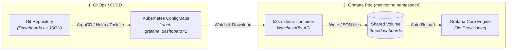

# 🔄 Grafana Git-Sync & Dashboard Provisioning in Airgapped Environments

This document evaluates **Git-Sync** for self-hosted, airgapped on-premise Grafana installations, explains why native cloud Git Sync is constrained in disconnected environments, and documents the recommended patterns for GitOps dashboard management.

---

## 🧭 Executive Summary

| Mechanism | Airgapped Feasibility | Primary Use Case | Recommendation for This Stack |
| :--- | :--- | :--- | :--- |
| **Native Grafana Git Sync (Cloud/v12)** | ❌ Limited / Infeasible | Grafana Cloud / public GitHub/GitLab.com with outbound Internet access. | **Not recommended** for airgapped clusters. |
| **Kubernetes `k8s-sidecar` (Current)** | ✅ 100% Native & Airgapped | Dashboards packaged as Kubernetes ConfigMaps via GitOps / Helm. | **Primary Recommended Pattern**. |
| **Kubernetes `git-sync` Sidecar** | ✅ Viable with internal Git | Directly polling an on-prem Git server (GitLab / Gitea) inside the VPC. | **Alternative** for large dashboards (>1MB). |

---

## 🔍 Detailed Evaluation

### 1. Native Grafana Git Sync (Why it does not fit airgapped environments)
Grafana's built-in Git Sync feature is designed primarily for connected environments (Grafana Cloud and Enterprise):
- **Outbound Connectivity Requirement:** It expects direct HTTPS or SSH access to cloud Git providers (GitHub, GitLab.com). In an airgapped data center or isolated VPC, the Grafana server cannot establish outbound connections.
- **Enterprise Licensing Constraints:** Many advanced bi-directional sync features ("Save to Git from UI") are restricted to Enterprise/Cloud tiers.
- **Internal Webhook Complexity:** For on-prem Git instances (e.g. self-hosted GitLab), it requires configuring ingress routing, SSL certificates, and webhook tokens between the Git server and the Grafana pod.

---

### 2. The Recommended Pattern: `k8s-sidecar` (Already Implemented)

In this repository, we utilize the **`k8s-sidecar` pattern**, configured directly in `values-grafana.yaml`:

```yaml
sidecar:
  dashboards:
    enabled: true
    label: grafana_dashboard
    labelValue: "1"
    searchNamespace: ALL
    folder: /tmp/dashboards
    folderAnnotation: grafana_folder
    provider:
      foldersFromFilesStructure: true
```

#### How it works:


#### Advantages for Airgapped Environments:
1. **Zero External Network Dependencies:** The sidecar talks exclusively to the local Kubernetes API server via standard service account tokens.
2. **True GitOps Parity:** Dashboards live in Git and are applied via standard tools (`helm`, `kubectl apply`, `argocd`, or `task infra:dashboards`).
3. **Automated Folder Classification:** The `grafana_folder` annotation automatically sorts dashboards into "Loki", "General", "Debezium", etc., without UI clicks.

---

### 3. Alternative: Kubernetes `git-sync` Sidecar (For Large Repositories)

If dashboards exceed the **1MB Kubernetes ConfigMap limit** or your team mandates direct Git checkout inside the pod:

A standard `registry.k8s.io/git-sync/git-sync` container can run as a sidecar alongside Grafana, polling an **internal, self-hosted Git server** (e.g., internal GitLab, Gitea, or Bitbucket Server):

```yaml
# Example values-grafana.yaml addition
extraContainers:
  - name: git-sync
    image: registry.k8s.io/git-sync/git-sync:v4.2.4
    args:
      - --repo=ssh://git@gitlab.internal.corp:22/observability/dashboards.git
      - --branch=main
      - --depth=1
      - --wait=60
      - --root=/tmp/dashboards
    volumeMounts:
      - name: dashboards-storage
        mountPath: /tmp/dashboards
      - name: git-secret
        mountPath: /etc/git-secret
        readOnly: true
```

---

## 🎯 Conclusion & Decision

For this sandbox and its production architecture (`ADR/grafana.md`):
- **Decision:** We stick with the **`k8s-sidecar` pattern**. It is 100% resilient, native to Kubernetes, requires zero external Git credentials inside the cluster, and operates seamlessly in completely airgapped environments.
- Native Grafana Cloud Git Sync is declared **out of scope** due to its cloud-first and external network requirements.
