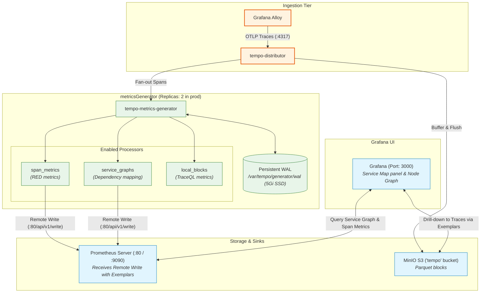

# 📊 Grafana Tempo: Metrics-from-Traces Architecture & Guide

This document summarizes the **Metrics-from-Traces** capabilities in Grafana Tempo, how they are configured in this sandbox (`dev`, `prod-local`, `prod`), and operational best practices learned from scanning the official documentation.

---

## 🧭 What is Metrics-from-Traces?

Rather than requiring separate application code to measure service latency, throughput, error rates (RED metrics), and dependency maps, Tempo's **`metrics-generator`** component derives metrics directly from incoming trace spans in real time and pushes them to Prometheus via Remote Write.

This provides two critical capabilities out of the box:
1. **Span Metrics (RED Metrics):** Generates `traces_spanmetrics_latency_*` (histograms) and `traces_spanmetrics_calls_total` (counters) partitioned by `service`, `span_name`, `status_code`, and custom attributes.
2. **Service Graphs:** Builds automated topological maps showing service dependencies, request rates, error percentages, and latency percentiles (`traces_service_graph_request_total`, `traces_service_graph_request_server_seconds_*`).

---

## 🏗️ Architecture & Component Flow



---

## ⚙️ Configuration in This Sandbox

### 1. Tempo Helm Values (`deployment/prod/values-tempo.yaml`)

```yaml
metricsGenerator:
  enabled: true
  replicas: 2
  resources:
    requests:
      cpu: 150m
      memory: 256Mi
    limits:
      memory: 512Mi
  persistence:
    enabled: true
    size: 5Gi # Critical: Persistent WAL prevents metric gaps across restarts
  config:
    storage:
      path: /var/tempo/generator/wal
      remote_write:
        - url: http://prometheus-server.monitoring.svc.cluster.local:80/api/v1/write
          send_exemplars: true # Links generated metrics directly to sample traces!
    processor:
      service_graphs: {}
      span_metrics: {}
      local_blocks: {}

overrides:
  defaults:
    metrics_generator:
      processors: [span-metrics, service-graphs]
      # Native histograms produce sparse exponential buckets for Prometheus
      generate_native_histograms: both
```

### 2. Prometheus Remote Write Receiver (`values-prometheus.yaml`)
Prometheus must accept the incoming metrics and retain exemplars:

```yaml
server:
  remoteWriteReceiver: true
  extraArgs:
    web.enable-remote-write-receiver: ""
    storage.tsdb.max-exemplars: "1000000"
```

### 3. Grafana Datasource Configuration (`datasources.yaml`)
Tempo connects to Prometheus to render service maps:

```yaml
- name: Tempo
  type: tempo
  uid: tempo
  url: http://tempo-query-frontend.monitoring.svc:3200
  jsonData:
    serviceMap:
      datasourceUid: 'prometheus'
    nodeGraph:
      enabled: true
```

---

## 🔍 Key Insights & Operational Best Practices

From reviewing the official Tempo documentation:

1. **WAL Persistence is Non-Negotiable:**
   The metrics generator requires local disk storage for its Write-Ahead Log (`/var/tempo/generator/wal`). Without a Persistent Volume (`persistence.enabled: true, size: 5Gi`), restarting a Tempo pod discards the in-flight metrics buffer, causing gaps in Service Graph edges and latency calculations.

2. **Both Classical and Native Histograms:**
   Setting `generate_native_histograms: both` ensures backward compatibility with traditional Prometheus bucket metrics (`_bucket`, `_sum`, `_count`) while unlocking high-resolution Prometheus 2.40+ sparse native histograms for dramatically lower storage space.

3. **Exemplars on Remote Write:**
   Enabling `send_exemplars: true` on the remote-write client ensures that latency histograms pushed into Prometheus carry trace IDs. Clicking on a service graph latency outlier in Grafana immediately loads the causative trace in Tempo.

4. **Multi-Tenant / Global Overrides:**
   Tempo requires processors to be explicitly activated under `overrides.defaults.metrics_generator.processors`. Defining the processor block alone under `metricsGenerator.config.processor` is not sufficient without the override toggle.

---

## 📊 Summary of Generated Metrics

| Metric Name | Type | Description |
| :--- | :--- | :--- |
| `traces_service_graph_request_total` | Counter | Total count of requests between client and server services. |
| `traces_service_graph_request_failed_total` | Counter | Count of failed requests between service edges. |
| `traces_service_graph_request_server_seconds_bucket` | Histogram | Request duration between caller and callee services. |
| `traces_spanmetrics_calls_total` | Counter | Total spans processed, partitioned by service, operation, and status code. |
| `traces_spanmetrics_latency_bucket` | Histogram | Execution duration of individual spans. |
